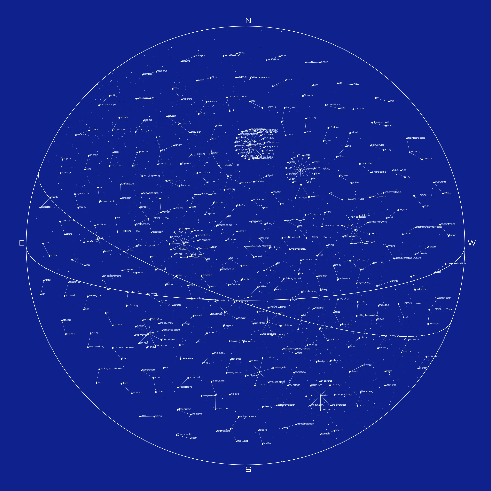

Title: Beyond the Word
Date: 2023-08-04 00:00
Category: post
card_image: /images/big_text.webp
hero_image: /images/big_text.webp
hero_caption: Photo credit: <a href="https://thelastindex.com"><strong>TheLastIndex</strong></a>
hero_text: I wanted to see the relationships between words of an AI generated text.

The text itself was the result of a fine-tuned version of GPT3 and is as follows:

> The photograph shows two people in their bathrobes walking along a crowded side street in Chinatown. The street is covered in snow and the rooftops, too, are blanketed with white. The woman is a forlorn figure. She appears to be hurrying along, as if late for an appointment or missing the last streetcar home. In truth, she simply seems uncomfortable, unsure where to place her arms and afraid to touch the shopping bags of food she carries. Her face is hidden from us by the balloon of her collar, the brim of her hat and by the shoulder of her companion, who is a handsome, dark-haired man. At his side, he carries a small white dog. Both are seen walking away, some distance apart and as if each proceeds on an errand of his own. How am I to know this? Read the word on his shirt, walk. Was my father somehow walking? Look at the figures behind the lone woman and her dog man. At each turn of the street, they, too, leave a station to proceed on their way. The repetition itself mesmerizes. We are in mid-winter. All but this couple — the woman, the dog man and several others — have books and bags of food. Their destination does not appear to be desirable. Their exhaustion shows in their faces — in the eyes and corners of mouths. Their passage is a test of their endurance and ability to endure together. There is no evidence that, like the woman and dog man, they share the same destination. Would I have thought, She is on her way to the bathrobe man — or, the bathrobe man on his way to her? I think, No. Nothing would have occurred between them but distance. There is fear and that, too, is mysterious. There is the length of the journey and I think this is what makes me, her, sad and also angry.

This text was created by a specially fine tuned version of GPT3. My methods were to web-scrape all the plain-text poems from Poetry Foundation. I then took a sub-set of this large corpus and split them into prompt and response format with the logic that one line of the poem was the prompt, and the next line was the expected response. Fine-tuning was quick but expensive.

It was unrelated to my end goal, but then I fed the text directly to [Dall-e](https://openai.com/index/dall-e-2/).


I needed to develop the data-structure that represented the words, and a [Markov chain](https://en.wikipedia.org/wiki/Markov_chain) seemed the most direct approach to abstracting language into a structure. To that end I employed [markovify](https://github.com/jsvine/markovify), [nltk](https://www.nltk.org/), and [networkx](https://networkx.org/) Python libraries to create an XML document for later consumption:

```python

import nltk
import markovify
from nltk.tokenize import sent_tokenize, word_tokenize

import networkx as nx
from networkx.readwrite import graphml


with open("poem.txt", 'r') as f:
    text = f.read()

text_model = markovify.Text(text)

# Get the state dictionary
state_dict = text_model.chain.model

# Create a directed graph representing the Markov chain
graph = nx.DiGraph()
for source_state, next_states in state_dict.items():

    for dest_state, prob in next_states.items():
        print(dest_state, prob)
        print(source_state, dest_state)
        graph.add_edge(' '.join(source_state), dest_state, weight=prob)

# Export the graph to an XML file
graphml.write_graphml(graph, "markov_chain.xml")

```


graphml tends to make very functional, but very flat graphs. Here is a small example:


Which is fine for small texts, but larger ones quickly become unreadable scrolls. When considering data visualization, I was reminded of a chapter from the book [Generative Design](http://www.generative-gestaltung.de/1/), M.6.0: Dynamic Data structures. In this text it is demonstrated that data connected by edges of nodes can “pull” connected nodes closer, the edges of the graph acting a bit like a spring or rubber band. When this runs long enough on some structures, it tends to make fields of geometric shapes or in the case of one-to-many relationships, radial, branching structures.

I thought of the stars.

I had need to parse the xml output from previous steps and put that into data structures representing the nodes and the edges that connect them. Since I was moving onto visualization, this and subsequent steps were performed in [processing](https://thelastindex.com/beyond/processing.org).

```java

 String xmlFilename = "markov_chain.xml"; // Replace with the path to your XML file
  XML graphXML = loadXML(xmlFilename);

  XML[] nodeElements = graphXML.getChildren("graph/node");
  for (XML nodeElement : nodeElements) {
    String id = nodeElement.getString("id");

    println(id);
    Node node = new Node(width/2+random(-1, 1), height/2 + random(-1, 1));
    node.setBoundary(5, 5, width-5, height-5);
    node.id = id;
    nodesMap.put(id, node);
  }

  springs = new ArrayList<>();
  XML[] springElements = graphXML.getChildren("graph/edge");
  for (XML springElement : springElements) {
    String nodeAId = springElement.getString("source");
    String nodeBId = springElement.getString("target");

    Node nodeA = nodesMap.get(nodeAId);
    Node nodeB = nodesMap.get(nodeBId);

    if (nodeA != null && nodeB != null) {
      Spring spring = new Spring(nodeA, nodeB);
      spring.setLength(100);
      spring.setStiffness(0.6);
      spring.setDamping(0.3);
      springs.add(spring);
    }
  }
  nodesArray = nodesMap.values().toArray(new Node[0]);

```

My Node and Spring objects were largely made with [code from the aforementioned book](http://www.generative-gestaltung.de/1/M_6_1_01) and so I will bypass those code excerpts, but here is the [entirety of the project](https://github.com/tetrismegistus/GenArt/tree/main/general_sketches/markovNodes).

The final concern of my vision were gestures that should make a person think of star charts. The biggest five gestures were the font, [Orbitron](https://fonts.google.com/specimen/Orbitron), the right shade of [blue](https://www.color-hex.com/color/0e218b), a circle, an Ecliptic, and an Equator.

Finally there’s the galactic disc, back in the background. I drew points along a standard deviation from a line through the chart:

```java

  for (int i = 0; i < numStars; i++) {
    float t = random(1);
    float xOnLine = lerp(circleX - circleRadius, circleX + circleRadius, t);
    float yOnLine = lerp(circleY - circleRadius, circleY + circleRadius, t);

    float offsetX = randomGaussian() * stdDev;
    float offsetY = randomGaussian() * stdDev;

    float x = xOnLine + offsetX;
    float y = yOnLine + offsetY;

    if (dist(x, y, circleX, circleY) <= circleRadius) {
      strokeWeight(random(.1, 3));
      point(x, y);
    }
  }

```

The sketch takes time as the nodes expand from each other. I watch and wait for the right frame to save the output. And finally, I can find my way through this sea of language:


