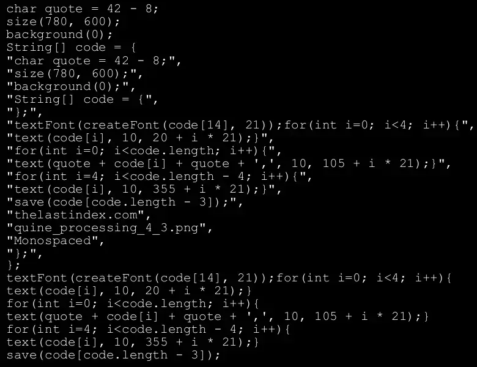
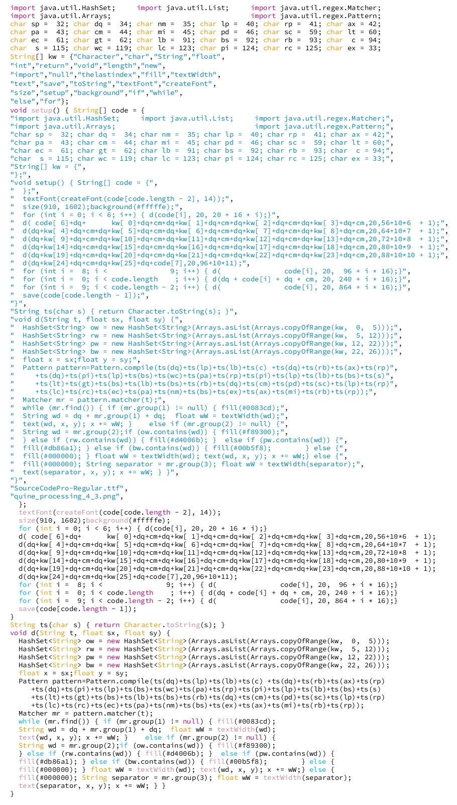

Title: A Visual Quine 
Date: 2023-09-01 00:00
Category: post
card_image: /images/quine_hero.webp
hero_image: /images/quine_hero.webp
hero_caption: Photo credit: <a href="https://thelastindex.com"><strong>TheLastIndex</strong></a>
hero_text: A study in self-referential typography.

Named after the philosopher [W.V. Quine](https://en.wikipedia.org/wiki/Willard_Van_Orman_Quine) because of his work on self-referentiality, a [Quine](https://en.wikipedia.org/wiki/Quine_(computing)) is a program that recieves no external input and yet displays itself.

Very much bric-a-brac adorning the shelf of computer science, quines aren’t a popular discipline, and are somewhat akin in general to [Code golf](https://en.wikipedia.org/wiki/Code_golf). They were used by none other than Ken Thompson to illustrate the impossibility of trusting software in the classic [Reflections on Trusting Trust](https://www.cs.cmu.edu/~rdriley/487/papers/Thompson_1984_ReflectionsonTrustingTrust.pdf).

Over the years I’ve been fond of browsing the unusual samples at [The Quine Page](https://www.nyx.net/~gthompso/quine.htm).

My first quine was pretty rudimentary. I wrote it in the language then familiar to me, python.

```python
aquine = "print('aquine = ' + repr(aquine) + '\\n' + 'intron = ' + repr(intron) + '\\n' + aquine)"
intron = "Hello from my first Quine."
print('aquine = ' + repr(aquine) + '\n' + 'intron = ' + repr(intron) + '\n' + aquine)
```

When run it appears exactly as it does above. One could copy and paste the output into a Python interpreter and the result would be the same. Note the “intron”. This is embedded information that is not reproduced on the screen more than once.

The brevity of source is due to the powerful [repr()](https://docs.python.org/3/library/functions.html#repr) function. repr() returns a printable representation of an object that should be executable as code. It does many things, like switching out single with double quote marks, for instance. This is useful for writing a short quine, but not necessary.

Recently I set out to challenge myself to write a quine that would display not a text representation of its source code, but a picture containing the source code. My first attempt was very much like a traditional quine, seeking only to produce its own source as literally as possible.

```java
char quote = 42 - 8;
size(780, 600);
background(0);
String[] code = {
"char quote = 42 - 8;",
"size(780, 600);",
"background(0);",
"String[] code = {",
"};",
"textFont(createFont(code[14], 21));for(int i=0; i<4; i++){",
"text(code[i], 10, 20 + i * 21);}",
"for(int i=0; i<code.length; i++){",
"text(quote + code[i] + quote + ',', 10, 105 + i * 21);}",
"for(int i=4; i<code.length - 4; i++){",
"text(code[i], 10, 355 + i * 21);}",
"save(code[code.length - 3]);",
"thelastindex.com",
"quine_processing_4_3.png",
"Monospaced",
"};"
};
textFont(createFont(code[14], 21));for(int i=0; i<4; i++){
text(code[i], 10, 20 + i * 21);}
for(int i=0; i<code.length; i++){
text(quote + code[i] + quote + ',', 10, 105 + i * 21);}
for(int i=4; i<code.length - 4; i++){
text(code[i], 10, 355 + i * 21);}
save(code[code.length - 3]);
```

And when run, the familiar results:



Attempt to represent quoted strings in quine can quickly fall into the trap of infinite regression. To avoid it here we are declaring a reference to the double quote that we can use directly when we want to represent a quote but don’t want to have to escape that quote because it’s embedded in a string.

Where we do rely upon quotation marks, they are kept limited to an array that will be iterated over in a few passes. Once to reproduce the code before the list. Once to reproduce the list itself, with quotes added, then another time to finish the rest of the code.

It works, but I wanted to take advantage of the visual aspect a bit more. I considered adding non-literal or abstract output to the screen that was in some way informed by the source code, but ultimately decided that I could be faithful to traditional quines and take advantage of the visual medium at the same time by employing syntax highlighting.

To do so I would need code that could take a string and highlight it the same way the processing IDE would. To that end I arrived at this block of code:

```java
void d(String t, float sx, float sy) {
  HashSet<String> ow = new HashSet<String>(Arrays.asList(Arrays.copyOfRange(kw,  0,  4)));
  HashSet<String> rw = new HashSet<String>(Arrays.asList(Arrays.copyOfRange(kw,  4, 12)));
  HashSet<String> pw = new HashSet<String>(Arrays.asList(Arrays.copyOfRange(kw, 12, 21)));
  HashSet<String> bw = new HashSet<String>(Arrays.asList(Arrays.copyOfRange(kw, 21, 24)));
  float x = sx;float y = sy;
  Pattern pattern=Pattern.compile(ts(dq)+ts(lp)+ts(lb)+ts(c) +ts(dq)+ts(rb)+ts(ax)+ts(rp)
     +ts(dq)+ts(pi)+ts(lp)+ts(bs)+ts(wc)+ts(pa)+ts(rp)+ts(pi)+ts(lp)+ts(lb)+ts(bs)+ts(s)
     +ts(lt)+ts(gt)+ts(bs)+ts(lb)+ts(bs)+ts(rb)+ts(dq)+ts(cm)+ts(pd)+ts(sc)+ts(lp)+ts(rp)
     +ts(lc)+ts(rc)+ts(ec)+ts(pa)+ts(nm)+ts(bs)+ts(ex)+ts(ax)+ts(mi)+ts(rb)+ts(rp));
  Matcher mr = pattern.matcher(t);
  while (mr.find()) { if (mr.group(1) != null) { fill(#0083cd);
  String wd = dq + mr.group(1) + dq;  float wW = textWidth(wd);
  text(wd, x, y); x += wW; }    else if (mr.group(2) != null) {
  String wd = mr.group(2);if (ow.contains(wd)) { fill(#f89300);
  } else if (rw.contains(wd)) { fill(#d4006b); }  else if (pw.contains(wd)) {
  fill(#db86a1); } else if (bw.contains(wd)) { fill(#00b5f8);        } else {
  fill(#FFFFFE); } float wW = textWidth(wd); text(wd, x, y); x += wW;} else {
  fill(#FFFFFE); String separator = mr.group(3); float wW = textWidth(separator);
  text(separator, x, y); x += wW; } }
}
```

Here I have two functions. One to simply cast a character type as a string. I wrap this in a function to shorten the code. Because I will be representing most of the code itself in string form, brevity is rewarded. That trend continues with rather opaque naming conventions: ow for orange words, rw for red words, etc.

The ugliness of that regex pattern was rather necessary. I would quickly get caught in regression trying to embed the many quotes required for a regular expression pattern. The Pattern is the engine of the highlighter.

Finally, notice the alignment of the code. This was partially for aesthetic reasons, but it also helps me debug the quoted sections. An inconsistency in alignment is usually a hint I forgot to change both the code and its representation.

The whole source looks like this:

```java
import java.util.HashSet;     import java.util.List;     import java.util.regex.Matcher;
import java.util.Arrays;                                 import java.util.regex.Pattern;
char sp =  32; char dq =  34; char nm =  35; char lp =  40; char rp =  41; char ax = 42;
char pa =  43; char cm =  44; char mi =  45; char pd =  46; char sc =  59; char lt = 60;
char ec =  61; char gt =  62; char lb =  91; char bs =  92; char rb =  93; char  c = 94;
char  s = 115; char wc = 119; char lc = 123; char pi = 124; char rc = 125; char ex = 33;
String[] kw = {"Character","char","String", "float",
"int","return","void","length","new",
"import","null","thelastindex","fill","textWidth",
"text","save","toString","textFont","createFont",
"size", "setup","background","if","while",
"else", "for"};
void setup() { String[] code = {
"import java.util.HashSet;     import java.util.List;     import java.util.regex.Matcher;",
"import java.util.Arrays;                                 import java.util.regex.Pattern;",
"char sp =  32; char dq =  34; char nm =  35; char lp =  40; char rp =  41; char ax = 42;",
"char pa =  43; char cm =  44; char mi =  45; char pd =  46; char sc =  59; char lt = 60;",
"char ec =  61; char gt =  62; char lb =  91; char bs =  92; char rb =  93; char  c = 94;",
"char  s = 115; char wc = 119; char lc = 123; char pi = 124; char rc = 125; char ex = 33;",
"String[] kw = {",
"};",
"void setup() { String[] code = {",
"  };",
"  textFont(createFont(code[code.length - 2], 14));",
"  size(910, 1602);background(#fffffe);",
"  for (int i = 0; i < 6; i++) { d(code[i], 20, 20 + 16 * i);}",
"  d( code[ 6]+dq+      kw[ 0]+dq+cm+dq+kw[ 1]+dq+cm+dq+kw[ 2]+dq+cm+dq+kw[ 3]+dq+cm,20,56+10*6  + 1);",
"  d(dq+kw[ 4]+dq+cm+dq+kw[ 5]+dq+cm+dq+kw[ 6]+dq+cm+dq+kw[ 7]+dq+cm+dq+kw[ 8]+dq+cm,20,64+10*7  + 1);",
"  d(dq+kw[ 9]+dq+cm+dq+kw[10]+dq+cm+dq+kw[11]+dq+cm+dq+kw[12]+dq+cm+dq+kw[13]+dq+cm,20,72+10*8  + 1);",
"  d(dq+kw[14]+dq+cm+dq+kw[15]+dq+cm+dq+kw[16]+dq+cm+dq+kw[17]+dq+cm+dq+kw[18]+dq+cm,20,80+10*9  + 1);",
"  d(dq+kw[19]+dq+cm+dq+kw[20]+dq+cm+dq+kw[21]+dq+cm+dq+kw[22]+dq+cm+dq+kw[23]+dq+cm,20,88+10*10 + 1);",
"  d(dq+kw[24]+dq+cm+dq+kw[25]+dq+code[7],20,96+10*11);",
"  for (int i =  8; i <               9; i++) { d(               code[i], 20,  96 + i * 16);}",
"  for (int i =  0; i < code.length    ; i++) { d(dq + code[i] + dq + cm, 20, 240 + i * 16);}",
"  for (int i =  9; i < code.length - 2; i++) { d(               code[i], 20, 864 + i * 16);}",
"  save(code[code.length - 1]);",
"}",
"String ts(char s) { return Character.toString(s); }",
"void d(String t, float sx, float sy) {",
"  HashSet<String> ow = new HashSet<String>(Arrays.asList(Arrays.copyOfRange(kw,  0,  5)));",
"  HashSet<String> rw = new HashSet<String>(Arrays.asList(Arrays.copyOfRange(kw,  5, 12)));",
"  HashSet<String> pw = new HashSet<String>(Arrays.asList(Arrays.copyOfRange(kw, 12, 22)));",
"  HashSet<String> bw = new HashSet<String>(Arrays.asList(Arrays.copyOfRange(kw, 22, 26)));",
"  float x = sx;float y = sy;",
"  Pattern pattern=Pattern.compile(ts(dq)+ts(lp)+ts(lb)+ts(c) +ts(dq)+ts(rb)+ts(ax)+ts(rp)",
"     +ts(dq)+ts(pi)+ts(lp)+ts(bs)+ts(wc)+ts(pa)+ts(rp)+ts(pi)+ts(lp)+ts(lb)+ts(bs)+ts(s)",
"     +ts(lt)+ts(gt)+ts(bs)+ts(lb)+ts(bs)+ts(rb)+ts(dq)+ts(cm)+ts(pd)+ts(sc)+ts(lp)+ts(rp)",
"     +ts(lc)+ts(rc)+ts(ec)+ts(pa)+ts(nm)+ts(bs)+ts(ex)+ts(ax)+ts(mi)+ts(rb)+ts(rp));",
"  Matcher mr = pattern.matcher(t);",
"  while (mr.find()) { if (mr.group(1) != null) { fill(#0083cd);",
"  String wd = dq + mr.group(1) + dq;  float wW = textWidth(wd);",
"  text(wd, x, y); x += wW; }    else if (mr.group(2) != null) {",
"  String wd = mr.group(2);if (ow.contains(wd)) { fill(#f89300);",
"  } else if (rw.contains(wd)) { fill(#d4006b); }  else if (pw.contains(wd)) {",
"  fill(#db86a1); } else if (bw.contains(wd)) { fill(#00b5f8);        } else {",
"  fill(#000000); } float wW = textWidth(wd); text(wd, x, y); x += wW;} else {",
"  fill(#000000); String separator = mr.group(3); float wW = textWidth(separator);",
"  text(separator, x, y); x += wW; } }",
"}",
"SourceCodePro-Regular.ttf",
"quine_processing_4_3.png",
};
  textFont(createFont(code[code.length - 2], 14));
  size(910, 1602);background(#fffffe);
  for (int i = 0; i < 6; i++) { d(code[i], 20, 20 + 16 * i);}
  d( code[ 6]+dq+      kw[ 0]+dq+cm+dq+kw[ 1]+dq+cm+dq+kw[ 2]+dq+cm+dq+kw[ 3]+dq+cm,20,56+10*6  + 1);
  d(dq+kw[ 4]+dq+cm+dq+kw[ 5]+dq+cm+dq+kw[ 6]+dq+cm+dq+kw[ 7]+dq+cm+dq+kw[ 8]+dq+cm,20,64+10*7  + 1);
  d(dq+kw[ 9]+dq+cm+dq+kw[10]+dq+cm+dq+kw[11]+dq+cm+dq+kw[12]+dq+cm+dq+kw[13]+dq+cm,20,72+10*8  + 1);
  d(dq+kw[14]+dq+cm+dq+kw[15]+dq+cm+dq+kw[16]+dq+cm+dq+kw[17]+dq+cm+dq+kw[18]+dq+cm,20,80+10*9  + 1);
  d(dq+kw[19]+dq+cm+dq+kw[20]+dq+cm+dq+kw[21]+dq+cm+dq+kw[22]+dq+cm+dq+kw[23]+dq+cm,20,88+10*10 + 1);
  d(dq+kw[24]+dq+cm+dq+kw[25]+dq+code[7],20,96+10*11);
  for (int i =  8; i <               9; i++) { d(               code[i], 20,  96 + i * 16);}
  for (int i =  0; i < code.length    ; i++) { d(dq + code[i] + dq + cm, 20, 240 + i * 16);}
  for (int i =  9; i < code.length - 2; i++) { d(               code[i], 20, 864 + i * 16);}
  save(code[code.length - 1]);
}
String ts(char s) { return Character.toString(s); }
void d(String t, float sx, float sy) {
  HashSet<String> ow = new HashSet<String>(Arrays.asList(Arrays.copyOfRange(kw,  0,  5)));
  HashSet<String> rw = new HashSet<String>(Arrays.asList(Arrays.copyOfRange(kw,  5, 12)));
  HashSet<String> pw = new HashSet<String>(Arrays.asList(Arrays.copyOfRange(kw, 12, 22)));
  HashSet<String> bw = new HashSet<String>(Arrays.asList(Arrays.copyOfRange(kw, 22, 26)));
  float x = sx;float y = sy;
  Pattern pattern=Pattern.compile(ts(dq)+ts(lp)+ts(lb)+ts(c) +ts(dq)+ts(rb)+ts(ax)+ts(rp)
     +ts(dq)+ts(pi)+ts(lp)+ts(bs)+ts(wc)+ts(pa)+ts(rp)+ts(pi)+ts(lp)+ts(lb)+ts(bs)+ts(s)
     +ts(lt)+ts(gt)+ts(bs)+ts(lb)+ts(bs)+ts(rb)+ts(dq)+ts(cm)+ts(pd)+ts(sc)+ts(lp)+ts(rp)
     +ts(lc)+ts(rc)+ts(ec)+ts(pa)+ts(nm)+ts(bs)+ts(ex)+ts(ax)+ts(mi)+ts(rb)+ts(rp));
  Matcher mr = pattern.matcher(t);
  while (mr.find()) { if (mr.group(1) != null) { fill(#0083cd);
  String wd = dq + mr.group(1) + dq;  float wW = textWidth(wd);
  text(wd, x, y); x += wW; }    else if (mr.group(2) != null) {
  String wd = mr.group(2);if (ow.contains(wd)) { fill(#f89300);
  } else if (rw.contains(wd)) { fill(#d4006b); }  else if (pw.contains(wd)) {
  fill(#db86a1); } else if (bw.contains(wd)) { fill(#00b5f8);        } else {
  fill(#000000); } float wW = textWidth(wd); text(wd, x, y); x += wW;} else {
  fill(#000000); String separator = mr.group(3); float wW = textWidth(separator);
  text(separator, x, y); x += wW; } }
}
```

Notice that I use character variable assignments not just for quotes, but for all sorts of characters used in the regex. This is to avoid unnecessary escape sequences. As before I am referring to the code itself in an array that I move over in different ways to either display or extract information I need to render the image.

Introns make it possible to embed strings that can later be later referred to, such as file names and font names.

And finally, here is the output itself.



Pardon me for repeating myself.

Finally, a note on the hero image. The author of LazyGui saw what I wanted and quickly threw together a little [sketch](https://github.com/KrabCode/LazySketches/blob/ad7eeca0c92f4ee2427e8becdcefb5c12f2fcd97/src/_23_09/ScreenshotRecursion.java) to recursively display the desktop. I highly recommend playing around with it on your own computer if you don’t mind the occasional feeling of vertigo.
