Title: Irregular Grids: A Case Study
Date: 2023-08-26 00:00
Category: post
card_image: /images/gentle_hero.webp
hero_image: /images/gentle_hero.webp
hero_caption: Photo credit: <a href="https://thelastindex.com"><strong>TheLastIndex</strong></a>
hero_text: Being a slightly deeper exploration of Irregular Grids.

I covered in breadth some things I’ve done with [Irregular Grids](https://thelastindex.com/igrid) in my last post. Let’s look at a project that uses one in depth.

A canvas for a [raster image](https://en.wikipedia.org/wiki/Raster_graphics) is a 2D array of pixels, nothing more, nothing less. In that sense, a raster image is already an irregular grid. Nonetheless a little extra abstraction helps when I want to organize disparately sized objects on the screen without them overlapping.

## Helpful Abstractions

The first such abstraction is the concept of an individual space. On the raster image itself you can think of this as a pixel. In fact, pixels contain actionable data; you can iterate over pixels and “know” if a thing has been placed there simply by checking its color. This approach ceases to be practical quickly, but let’s consider it.

Here I will create a totally white background and draw rectangles (simplest use case for now) of random sizes on the screen, presuming the area I would draw on does not already contain another rectangle.

I will test whether a pixel has been drawn on by sampling its color.

```java
boolean pixelIsOccupied(int x, int y) {
  // For speed reasons we'll use the pixels array rather than get()
  // see https://processing.org/tutorials/pixels    
  loadPixels();
  int addr = x + y * width;
  color col = pixels[addr];
  if (red(col) == 255 && green(col) == 255 && blue(col) == 255) 
    return false;
  return true;
}
```

We also need to evaluate an area of space, not just one pixel. This function would in turn be called by another.

```java
boolean isRectOccupied(int x, int y, int w, int h) {
  for (int row = y; row < y + h; row++) {
    for (int col = x; col < x + w; col++) {
      if (pixelIsOccupied(col, row))
        return true;
    }
  }
  return false;
}
```

That should check whether a pixel is occupied, let’s use it:

```java
void setup() {
  size(1000, 1000);
  background(255);
}

void draw() {
  int maxWidth = 50;
  int maxHeight = 50;
  int upperLeftX = (int) random(0, width - maxWidth);
  int upperLeftY = (int) random(0, height - maxHeight);
  int w = (int) random(2, maxWidth);
  int h = (int) random(2, maxHeight);
  if (!isRectOccupied(upperLeftX, upperLeftY, w, h)) {
    rect(upperLeftX, upperLeftY, w, h);
  }
}
```

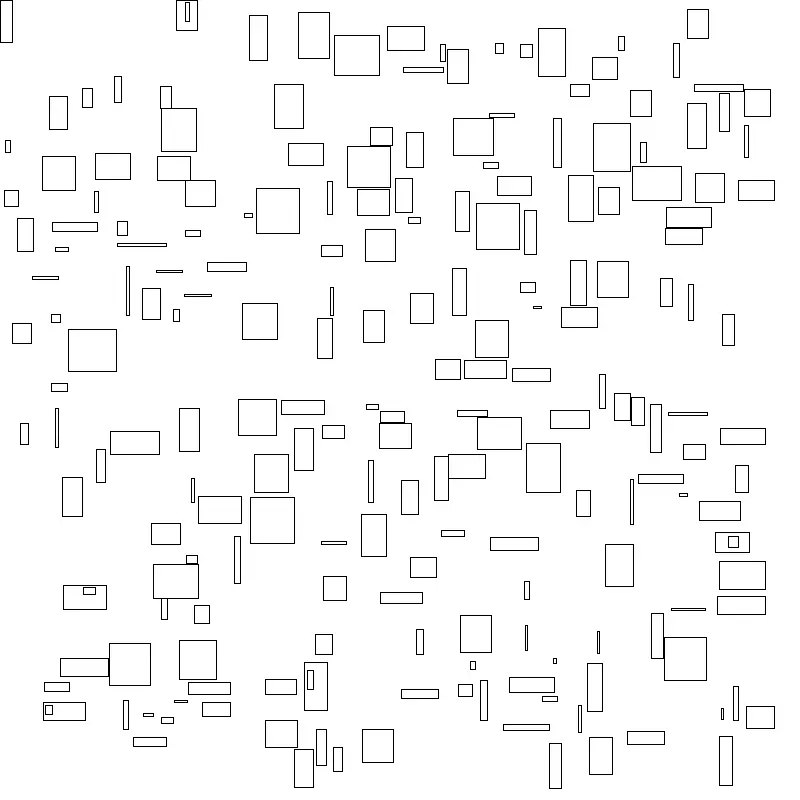

One doesn’t have to walk far down this road before they realize it isn’t paved well. A probably not exhaustive list:

* Rectangles that are white will be drawn within.
* Data and display are tied together, making it hard to change or work with either independently.
* The background can never be updated.

Some problems could be mitigated by using one PGraphics object as a data layer and another to draw on, and that might be very efficient (see my [post](https://thelastindex.com/noisyshader/) on representing Game of Life on a fragment shader), but it isn’t very intuitive and loses a lot of the abstraction and expressiveness available to a language like Java.

To that end it helps to have some sort of data representing the state of the drawing, even if that’s as simple as a 2D array of Boolean values. I’m going to skip that step however and make an object representing the smallest available space for drawing in my sketch: a Tile.

```java
class Tile {
  int x, y;
  float tileSize;
  Tile (int x, int y, float ts) {
    this.x = x;
    this.y = y;
    this.tileSize = ts;
  }
}
```

One couldn’t ask for a simpler Class, but alas, complexity is going to creep in soon enough. Ultimately, of course, this is going to go in a 2D array, but that’s not going to be enough. Notice above that I had another function to check if the rectangle could be drawn by iterating over all the pixels in its area? I need an abstraction for this too. One reason to do so is because I don’t want to draw individual Tiles (or pixels) by themselves. I want to render an entire rectangle. For many reasons it is useful to know metadata about the rectangle that is similar to, but not isomorphic with, the data about its tiles.

A bare bones abstraction would look something like this:

```java
class TileRect {
  float x, y;
  int w, h;
  color c;
  float tileSize;

  TileRect(float x, float y, int w, int h, color c, float tileSize) {
    this.x = x;
    this.y = y;
    this.w = w;
    this.h = h;
    this.tileSize = tileSize;
    this.c = c;
  }

  boolean place(Tile[][] b) {
    if (checkIsValid(b)) {
        for (float cx = x; cx < x + w; cx++) {
            for (float cy = y; cy < y + h; cy++) {
                b[(int)cy][(int)cx] = new Tile((int)cx, (int)cy, tileSize);
            }
        }
        return true;
    }
    return false;
  }

  boolean checkIsValid(Tile[][] b) {
    if (x + w > b[0].length) {
      return false;
    }

    if (y + h > b.length) {
      return false;
    }

    for (int cx = (int) x; cx < x + w; cx++) {
      for (int cy = (int) y; cy < y + h; cy++) {
        if (b[cy][cx] != null) {
          return false;
        }
      }
    }
    return true;
  }

  void render() {
    float lX = x * tileSize;
    float lY = y * tileSize;
    float lW = w * tileSize;
    float lH = h * tileSize;
    fill(this.c);
    rect(lX, lY, lW, lH;
  }
}
```

With this class alone we:

* know what pixels are contained by our rectangle
* know what color to render it in
* define a way of checking whether or not it can be placed on board of Tiles, etc.
* gain the ability to scale our Tiles arbitrarily.
* and probably a touch out of place in this class, a way of initializing the rectangle’s component tiles on the board.

Knowing the color may seem a silly feature, but if we were combining the data layer with the visualization layer and say, choosing random colors, each rectangle would have a different color every frame! This allows us to pick a color and stick with it.

The careful observer may also have noted that while we still are using integers for our array, our coordinates need not be integers at all. It is also worth noting that anything at all could be rendered within that space, even arbitrary images. All the information we need is present. I’m just sticking with rectangles for this project.

We must add a little more abstraction before we’re ready to run with this, and that is the drawable grid of tiles. At this point this probably seems like a LOT more code to just get back to where we can draw, and it is, but we’re gaining considerably in flexibility. What we’re doing is effectively designing an interface to our grid.

```java
lass Board {
  float x, y;
  int rows;
  int cols;
  float tileSize;
  Tile[][] board;
  ArrayList<TileRect> rects = new ArrayList<TileRect>();

  // Modify the constructor to accept two palettes
  Board(float x, float y, int r, int c, float tileSize) {
    this.x = x;
    this.y = y;
    rows = r;
    cols = c;
    board = new Tile[rows][cols];
    this.tileSize = tileSize;
  }

  TileRect tryPlaceTile(int startX, int startY, int startWidth, int startHeight) {
    TileRect tr = new TileRect(startX, startY, startWidth, startHeight,  color(random(255)), tileSize);
    if (tr.checkIsValid(board)) {
        tr.place(board);
        return tr;
    }
    return null;  // No valid placement was found.
  }


  void render() {
    for (TileRect tr : rects) {
      tr.render();
    }
  }
}
```

With that I believe we have everything we need to place items on the grid with confidence that they will not overlap any others. Because we separated data and visualization, we can also try to place a bunch of tiles before we draw. If were constrained to do so during the draw loop the sketch could run slowly.

Note that we can draw this “Board” anywhere. This allows a canvas to have multiple irregular grids that can be placed independently of each other. We could even put irregular grids inside of regular grids to make sure the children don’t overlap with each other!

Also note that we are storing the rectangles in an ArrayList, and we aren’t concerned with any indexes. Only the actual tiles need to be stored in a 2D array and accessed accordingly.

Let’s just see what this gets us. I’ll initialize the board, try to place 10000 tiles on it, then render it.

```java
Board board;

void setup() {
  board = new Board(0, 0, 80, 80, 10);
  for (int i = 0; i < 10000; i++) {
    int x = (int) random(board.board.length);
    int y = (int) random(board.board[0].length);
    int r = (int) random(1, 20);
    int c = (int) random(1, 20);
    TileRect tileRect = board.tryPlaceTile(x, y, r, c);
    if (tileRect != null)
      board.rects.add(tileRect);
  }
  size(800, 800);
}

void draw() {
  background(255);
  board.render();
}
```

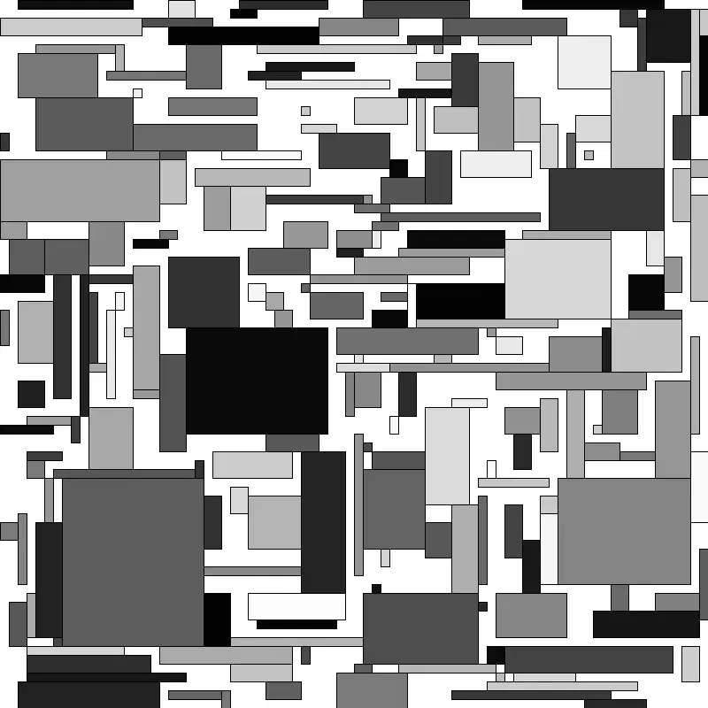

This may look very impressive yet, but we have a lot we can leverage in the search of interesting outputs now. For instance, one might want to “pack” in as much as they can to board.

## Improving appearances

To do so, let’s adjust our tryPlaceTile method with one that will keep trying to place the tile at smaller sizes until it succeeds or finds it cannot be placed at any size. This is not the most efficient solution, but it does help us avoid having to implement an actual quadTree to solve the problem.

```java
 TileRect tryPlaceTile(int startX, int startY, int startWidth, int startHeight) {
    TileRect tr = new TileRect(startX, startY, startWidth, startHeight,  color(random(255)), tileSize);
        while (width > 0 && height > 0) {
            if (tr.checkIsValid(board)) {
                tr.place(board);
                return tr;
            }
            // Decrement the width and height to check for smaller tile sizes.
            if (startWidth > 1) startWidth--;
            if (startHeight > 1) startHeight--;
            tr.w = startWidth;
            tr.h = startHeight;
        }
        return null;  // No valid placement was found.
  }
```

This can be leveraged with a fillBoard method:

```java
  void fillBoard() {
    for (int ty = 0; ty < board.length; ty++) {
      for (int tx = 0; tx < board[ty].length; tx++) {
        if (board[ty][tx] == null) {
          TileRect tr = tryPlaceTile(tx, ty, (int)random(4, MAX_TILE_WIDTH), (int)random(4, MAX_TILE_HEIGHT));
          if (tr != null) {
              rects.add(tr);
          }
        }
      }
    }
  }
```

It should be called after the board is initialized.

```java
void setup() {
  board = new Board(0, 0, 80, 80, 10);
  board.fillBoard();
  size(800, 800);  
  noLoop();
}
```

And with that we have a filled, if rather still uninteresting grid:

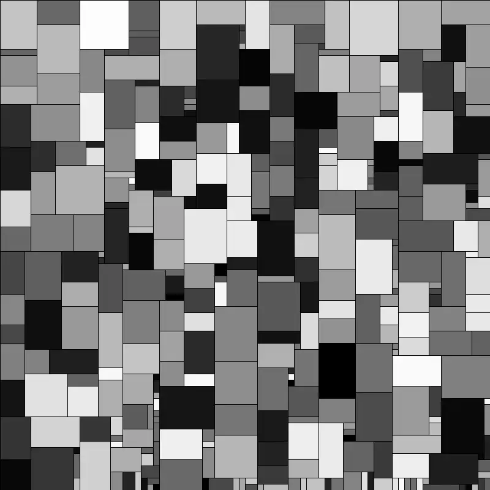

Color goes a long way to making any output more appealing.

When not deriving color in some way such as linear interpolation, it’s common to want to choose colors from a pre-established palette. To that end, let’s make a palette that we can randomly choose from:

```java
class ColorPalette {
    color[] colors;

    ColorPalette(color[] colors) {
        this.colors = colors;
    }

    color getRandomColor() {
        return colors[(int)random(colors.length)];
    }
}
```

One can then trivially call getRandomColor as each tile is created.

```java
// in our global name space
ColorPalette PAL_A = new ColorPalette(new color[] {#D64045, #1D3354, #9ED8DB, #467599});

// then later on in tryPlaceTile
TileRect tr = new TileRect(startX, startY, startWidth, startHeight,  PAL_A.getRandomColor(), tileSize);
```

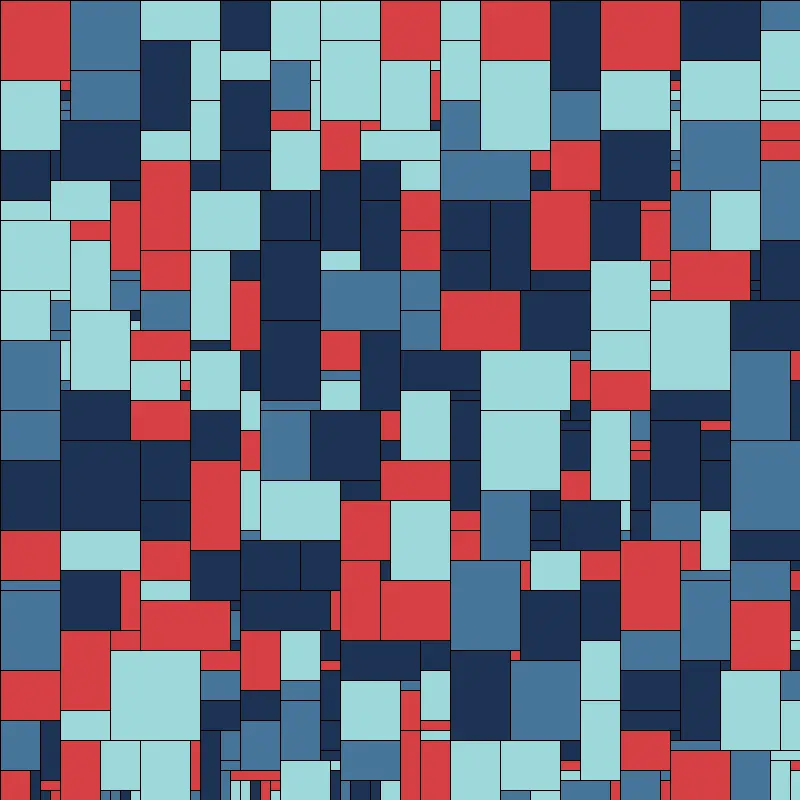

This is okay, but it still isn’t very much to look at. The primary problem to my eye is that it is way too random. The placement of the colors, the lack of coherent negative space makes this look rather like an indistinct mess.

It was in an earlier [post](https://thelastindex.com/noisylife/) that I said Perlin Noise is a tremendously seductive technique, and it is so for reasons like this. One wants to organize what is being done in some way, but one wants to maintain an element of unpredictability. Perlin noise fills that space nicely. I’m actually going to use an implementation of OpenSimplex Noise this time, but the principle remains what it was: the noise will give me a floating point number in a predictable range such that the number is related to others near it in a 2D space.

I did not write the implementation of OpenSimplex noise that will be used here, and it’s rather long so I won’t be pasting the code either, but it can be found [here](https://github.com/tetrismegistus/GenArt/blob/main/not_written_by_me/OpenSimplexNoise.java).

OpenSimplex noise tends to be a lot “curvier” than the default implementation of Perlin Noise in the processing library, so one thing I like to do is apply Octaves to get a little more variety out of it.

I can do so like this:

```java
float evalNoiseWithOctaves(float x, float y, int octaves, float persistence, float scale) {
    float total = 0;      // The accumulated noise value.
    float frequency = 1;  // The frequency of the current octave.
    float amplitude = 1;  // The amplitude of the current octave.
    float maxValue = 0;   // Used for normalizing the result to [0, 1].

    for (int i = 0; i < octaves; i++) {
        total += (float) oNoise.eval(x * frequency * scale, y * frequency * scale) * amplitude;

        maxValue += amplitude;
        amplitude *= persistence;
        frequency *= 2;
    }

    return total / maxValue;  // Normalize to [0, 1].
}
```

We can then declare and later use the noise to determine whether or not a given rect will be filled in.

```java
// in global namespace
OpenSimplexNoise oNoise;
int OCTAVES = 4;
float PERSISTENCE = 0.5f;
float FILL_THRESHOLD = 0;
float NOISE_SCALE = 0.001;

// in setup or when generating the board
Random rand = new Random();  			// using the java random library
long randomLongValue = rand.nextLong();         // to choose a random seed
oNoise = new OpenSimplexNoise(randomLongValue); // so output differs when I rerun it

//...

//in tileRect render method
float n = evalNoiseWithOctaves(lX, lY, OCTAVES, PERSISTENCE, NOISE_SCALE);
if (n > FILL_THRESHOLD) {
    outputBuffer.stroke(BACKGROUND_COLOR);
    outputBuffer.fill(randomColor);
} else {
    outputBuffer.stroke(randomColor);
    outputBuffer.noFill();
}
```

To get any appreciable organization out of this we’ll want to bump up the number of quads we’re trying to pack in, somehow. For now I’ll use smaller maximum sizes, decrease the scale of our tiles, and a larger canvas.

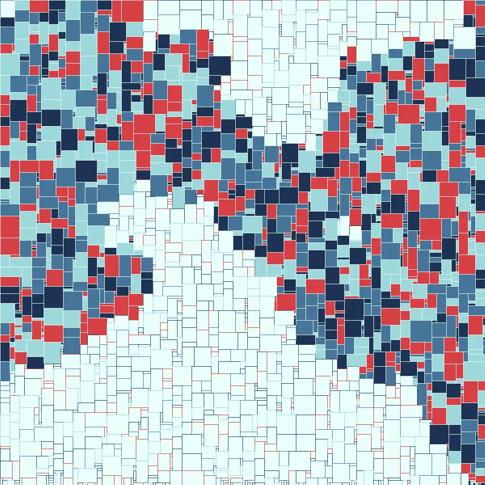_

## An interlude about problem spacePermalink

That does the job of giving paths for the eye to follow, but I want to point out that as this sketch grows in complexity, we’re discovering a number of variables that can drastically change the appearance of the output. I’ve been pointing these out as they pop up by putting them into global namespace (this makes them easier to spot and change rather than digging around inside classes or functions), but as this continues to grow this becomes more a project of exploring those “dimensions”. Stopping to edit code then rerun the project can slow down exploration.

Exploring these spaces is the heart and soul of generative art, and probably the major source of annoyance for my friends and family as I spam them with slightly different outputs.

One powerful way to speed up this exploration is to build GUI elements to change things while I’m running my sketch. To that end I have a fondness for [LazyGUI](https://github.com/KrabCode/LazyGui). This wonderful library allows me to quickly declare UI elements and tie them to values.

Using LazyGUI is very intuitive; let’s reorganize parts of the sketch to take advantage of it. I’m going to do several things at once here.

First, I will change the rendering mode to P2D, LazyGUI requires it. On my OS this means larger canvases can get truncated. To allow me to draw on arbitrarily large canvases I will create a bufferImage that I draw to, and simply resize it to a canvas that fits my screen. I will create functions to generate the board and redraw the board. This will allow me to see changes without closing and rerunning my sketch. Then I will add GUI elements and tie them to the global variables that I want to explore.

It ends up looking something like this:

```java
import java.util.Random;

LazyGui gui;
OpenSimplexNoise oNoise;

Board board;
ColorPalette PAL_A = new ColorPalette(new color[] {#D64045, #1D3354, #9ED8DB, #467599});

int MAX_TILE_WIDTH  = 10;
int MAX_TILE_HEIGHT = 10;
int OCTAVES = 4;
int outputWidth = 1000;
int outputHeight = 1000;
int previewWidth = 1000;
int previewHeight = 1000;
float PERSISTENCE = 0.5f;
float FILL_THRESHOLD = 0;
float NOISE_SCALE = 0.002;
float TILE_SIZE = 5;
float STROKEWEIGHT = 1;

color BACKGROUND_COLOR = #E9FFF9;
PGraphics outputBuffer;


void setup() {
  Random rand = new Random();
  long randomLongValue = rand.nextLong();
  oNoise = new OpenSimplexNoise(randomLongValue);
  size(1000, 1000, P2D);
  gui = new LazyGui(this);
  genBoard();
  displayBoard();
}

void draw() {
  background(BACKGROUND_COLOR);

  NOISE_SCALE = gui.slider("NOISE_SCALE", NOISE_SCALE, 0.00001, 0.01);
  FILL_THRESHOLD = gui.slider("FILL_THRESHOLD", FILL_THRESHOLD, -1.0, 1.0);
  OCTAVES = gui.sliderInt("OCTAVES", OCTAVES, 1, 10); // Example with a max of 10 octaves
  PERSISTENCE = gui.slider("PERSISTENCE", PERSISTENCE, 0.1, 1.0);
  STROKEWEIGHT = gui.slider("STROKEWEIGHT", STROKEWEIGHT, 1, 10);
  MAX_TILE_WIDTH = gui.sliderInt("MAX_TILE_WIDTH", MAX_TILE_WIDTH, 2, 100);
  MAX_TILE_HEIGHT = gui.sliderInt("MAX_TILE_HEIGHT", MAX_TILE_HEIGHT, 2, 100);

  if(gui.button("regen")){
    genBoard();
  }
  if(gui.button("rerender")){
    displayBoard();
  }

  image(outputBuffer, 0, 0, previewWidth, previewHeight);
}


void genBoard() {
  Random rand = new Random();
  long randomLongValue = rand.nextLong();
  oNoise = new OpenSimplexNoise(randomLongValue);

  board = new Board(0, 0, 200, 200, TILE_SIZE);
  board.fillBoard();
}

void displayBoard() {
  outputBuffer = createGraphics(outputWidth, outputHeight, P2D);
  outputBuffer = createGraphics(outputWidth, outputHeight, P2D);
  outputBuffer.beginDraw();
  outputBuffer.clear();
  outputBuffer.strokeWeight(STROKEWEIGHT);
  outputBuffer.colorMode(HSB, 360, 100, 100, 1);
  outputBuffer.background(BACKGROUND_COLOR);
  board.render();
  outputBuffer.endDraw();
}

```

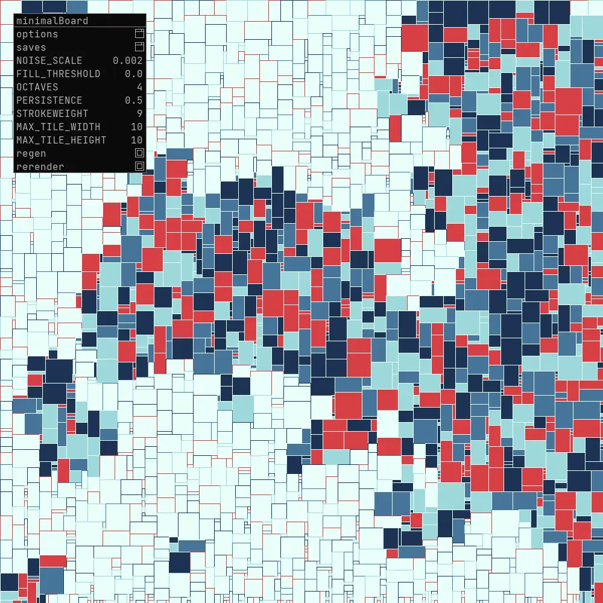

## Pulling it all together

Before we leave the code altogether, let’s add a few features that I think can make some difference.

One thing I want is to be able to make the rectangles smaller than their actual size. To do so I’ll pass a percentage by which I wish to shrink the rectangles to their rendering function and put in some safeguards so that I don’t get negatively sized rectangles that destroy the coherency of the grid.

```java
float actualPadding = Math.min(lW, lH) * paddingPercentage;

if (lW - 2 * actualPadding <= 1 || lH - 2 * actualPadding <= 1) {
  return;  // If after subtracting padding the rectangle would disappear, we don't render it.
}

outputBuffer.rect(lX + actualPadding, lY + actualPadding, lW - 2*actualPadding, lH - 2*actualPadding);
```

Not forgetting to add a GUI element for the padding, I can now play with rectangle spacing:

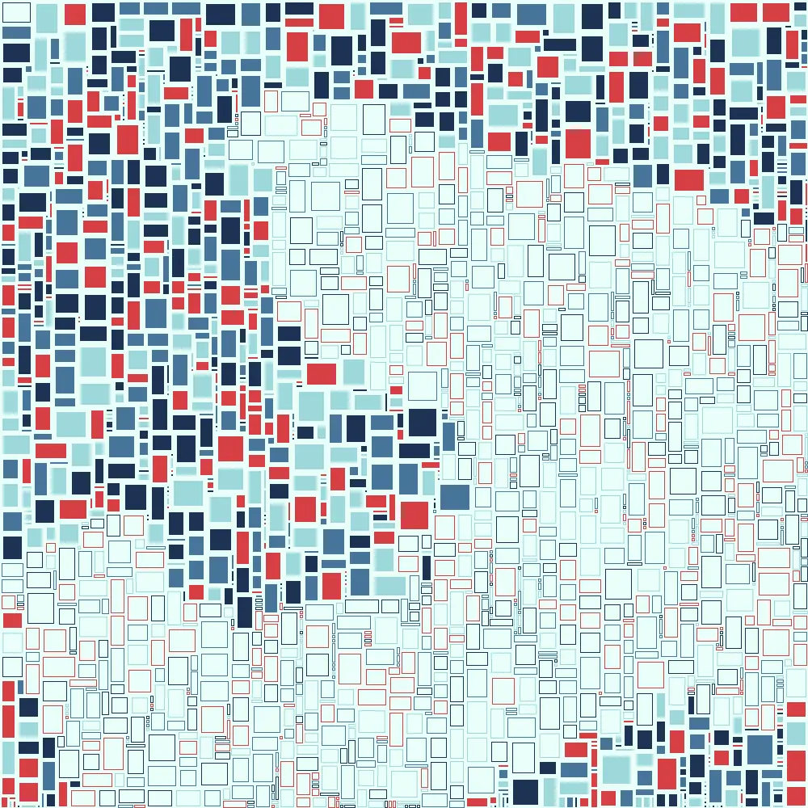

While I like the output so far, I wonder what it would be like to have the option to group the colors somewhat by noise. Let’s add a toggle to the GUI to switch between coloring modes and logic to group the colors when it is desired. To make this possible I split my color into two palettes and choose the palette based on noise.

```java
ColorPalette activePalette;
if (useNoiseForPalette) {
   activePalette = (n > COLOR_THRESH) ? paletteA : paletteB;
} else {
   activePalette = (random(1) > .5) ? paletteA : paletteB;
}

color randomColor = activePalette.getRandomColor();
```

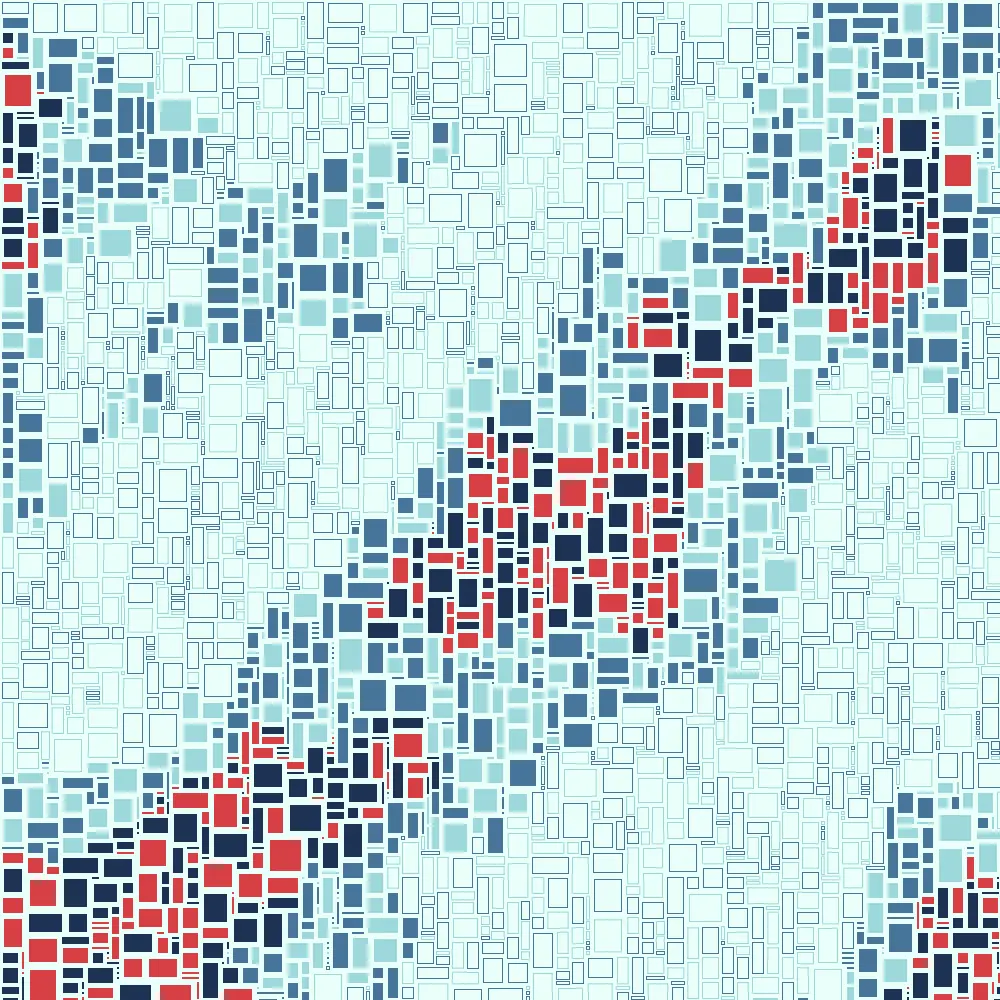

And there we go! That was quite a journey, and I thank you for staying with me through it. To finish, here are some outputs created with this sketch chosen to emphasize how different they can be just based on the variables added to the GUI.


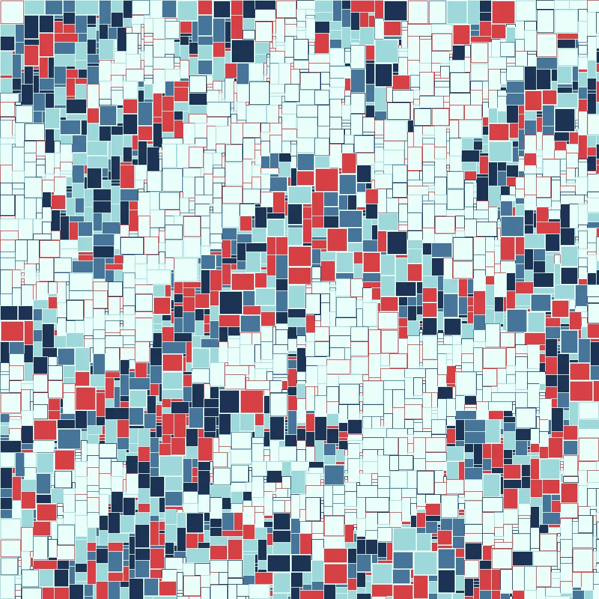

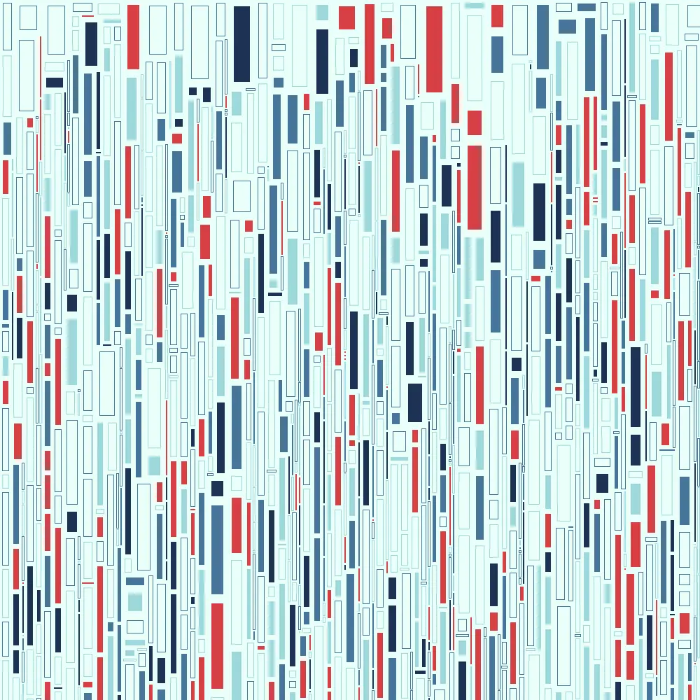

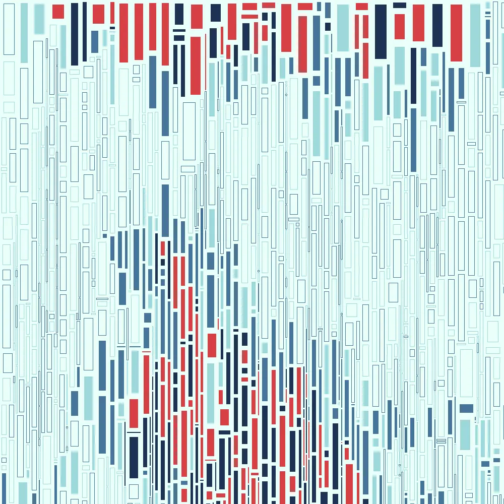

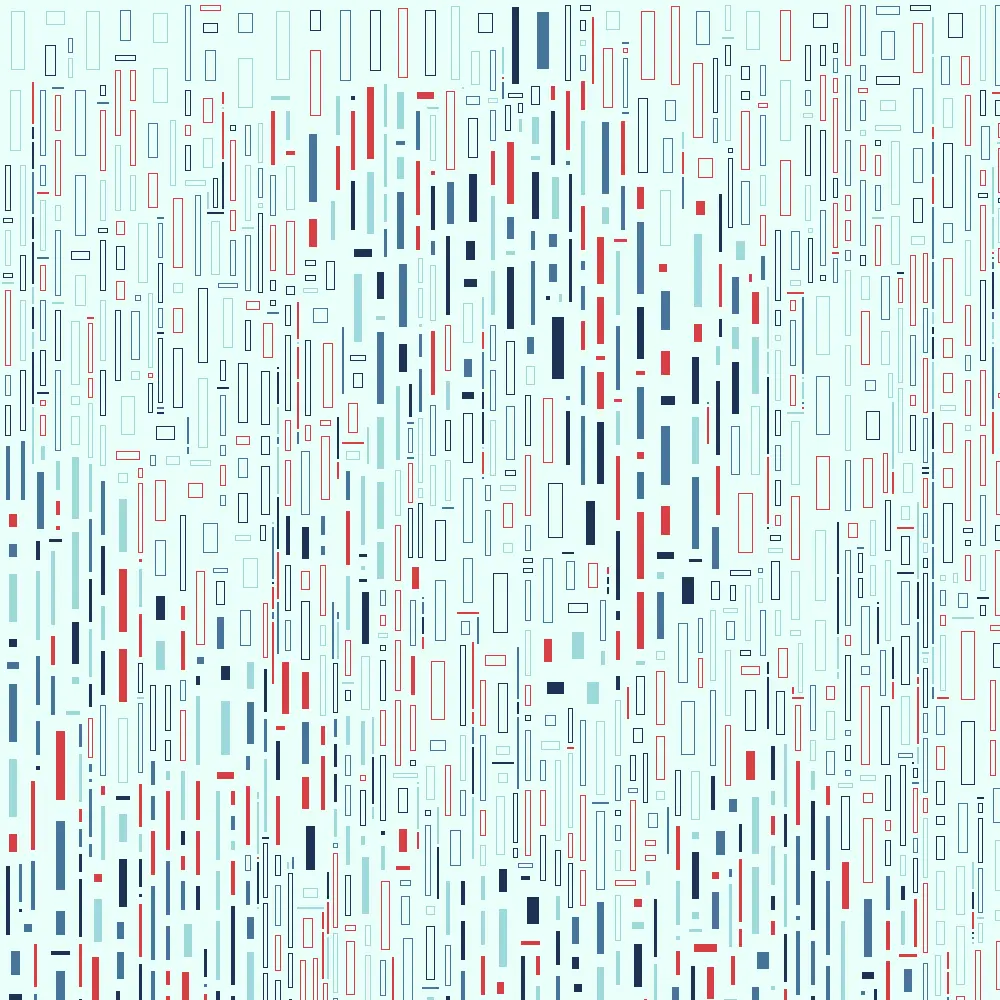

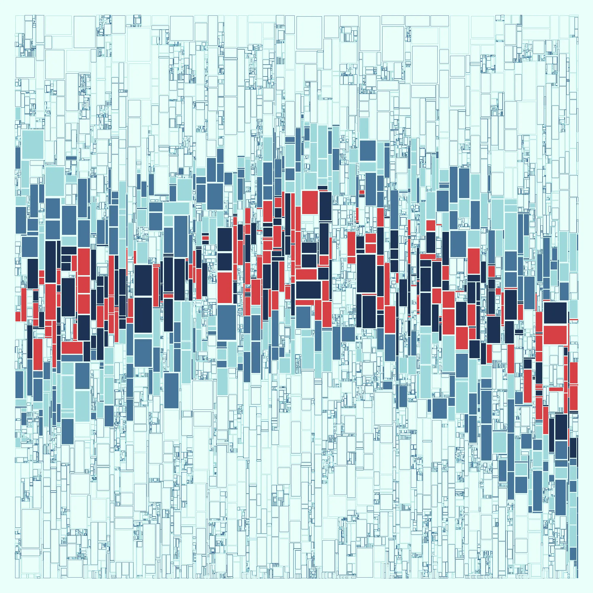

[Source code](https://github.com/tetrismegistus/GenArt/tree/main/general_sketches/minimalBoard).
