Title: Irregular Grids I've Known
Date: 2023-08-25 00:00
Category: post
card_image: /images/m2.webp
hero_image: /images/m2.webp
hero_caption: Photo credit: <a href="https://thelastindex.com"><strong>TheLastIndex</strong></a>
hero_text: Being a gentle exploration of Irregular Grids.

Irregular grids, as discussed in this [wonderful article](https://www.gorillasun.de/blog/an-algorithm-for-irregular-grids/) by Ahmad Moussa, are tremendously useful and versatile tools for generative art.

Briefly, irregular grids are grids that have been broken down conceptually in such a way that they need not hold squares of equal sizes. If you wish to find approaches to constructing such grids, I strongly recommend Moussa’s discussion on the matter.

I’d just like to share some applications I’ve found for them in my own art.

[Mondrian](https://en.wikipedia.org/wiki/Piet_Mondrian) is a favorite of mine, and you may find I don’t stray far from this inspiration during this discussion. I knew immediately what my first application would be:

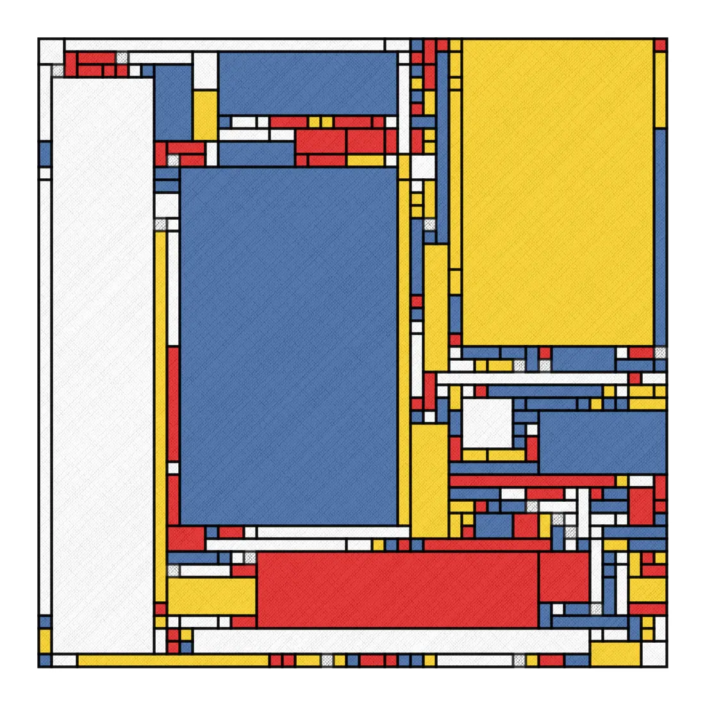

Notice that texturing? It’s a simple technique, but a bit slow when applied naively. The idea is to draw lots of little diagonal lines between two connecting sides of a square or rectangle, then create a crosshatch with diagonal lines going the opposite direction. The art is more in the variation of the strokeWeight according to a noise function along those lines. Here is a sample implementation:

```java
void drawCanvas() {
  float spacing = 5;
  for (int i = -width; i < height + width; i+=spacing) {
    stroke(0, random(.1, .3));
    tline(i, 0, i + height, height);
  }
  for (int i = height + width; i >= -width; i-=spacing) {
    stroke(0, random(.1, .3));
    tline(i, 0, i - height, height);
  }
}


void tline(float x1, float y1, float x2, float y2) {
  float tmp;
  /* Swap coordinates if needed so that x1 <= x2 */
  if (x1 > x2) { tmp = x1; x1 = x2; x2 = tmp; tmp = y1; y1 = y2; y2 = tmp; }

  float dx = x2 - x1;
  float dy = y2 - y1;
  float step = 1;

  if (x2 < x1)
    step = -step;

  float sx = x1;
  float sy = y1;
  for (float x = x1+step; x <= x2; x+=step) {
    float y = y1 + step * dy * (x - x1) / dx;
    strokeWeight(1 + map(noise(sx, sy), 0, 1, -0.5, 0.5));
    line(sx, sy, x + map(noise(x, y), 0, 1, -1, 1), y + map(noise(x, y), 0, 1, -1, 1));
    sx = x;
    sy = y;
  }
}
```

While homage is all very fine, this is a bit literal an imitation. One variation I thought of was emphasizing the regular parts of the grid with circles, then changing the probability of increasing the width (or height) along a given axis. This is the result:

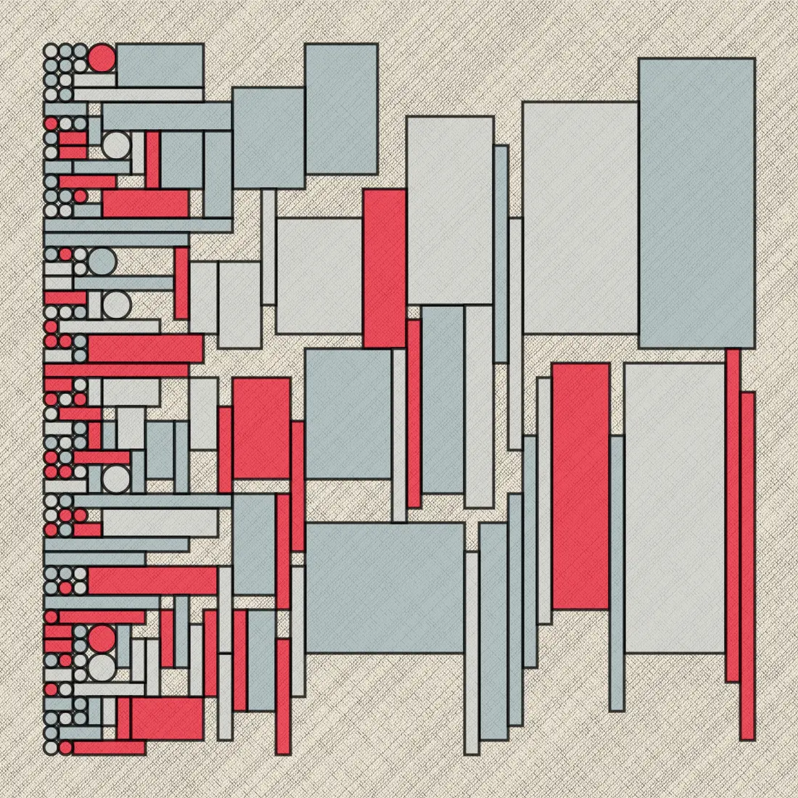

In the search of new territory, I had some fun trying my best to obscure the grid with shape and color, while focusing less on texture.

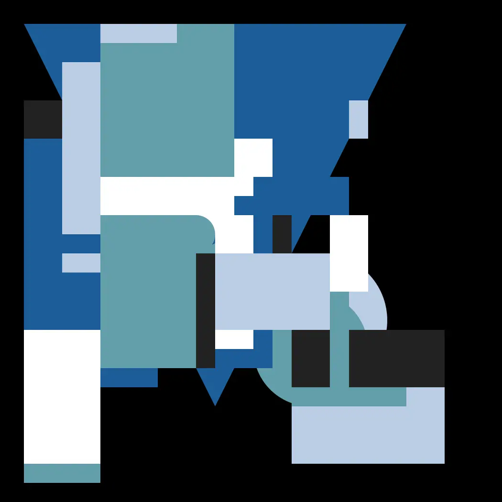

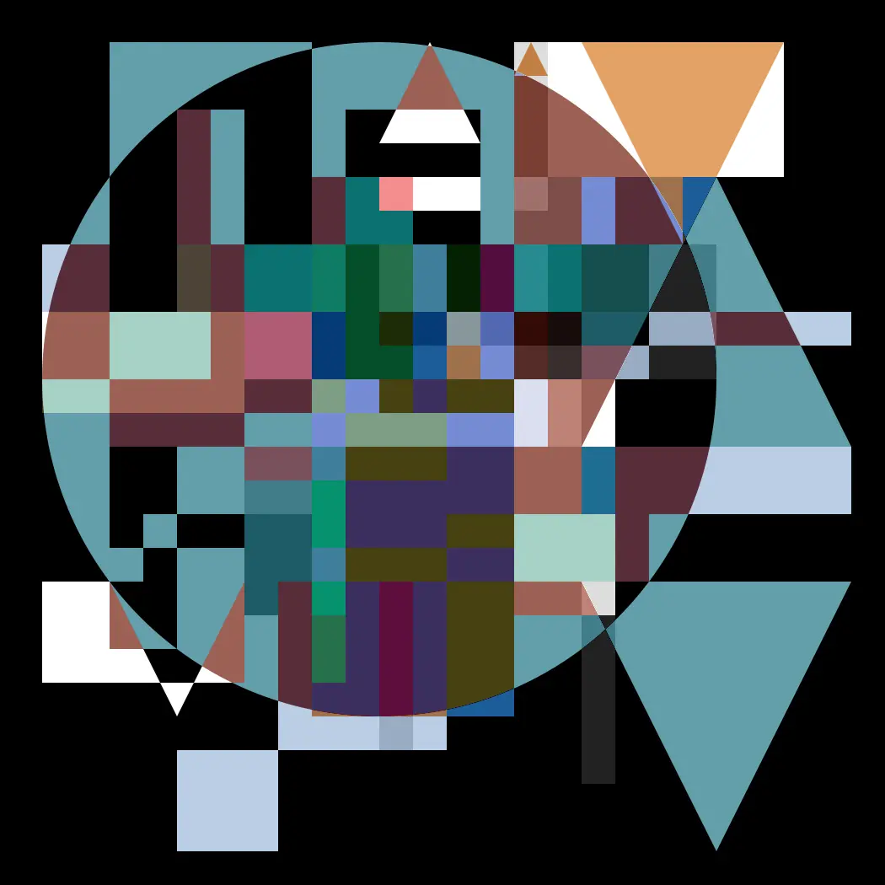

I actually had many experiments along these lines, but most of them are too chaotic and unorganized. These experiments weren’t too productive, but they did lead me to experiments with typography. Here I’m masking the grid with text from [The Wasteland](https://www.poetryfoundation.org/poems/47311/the-waste-land).

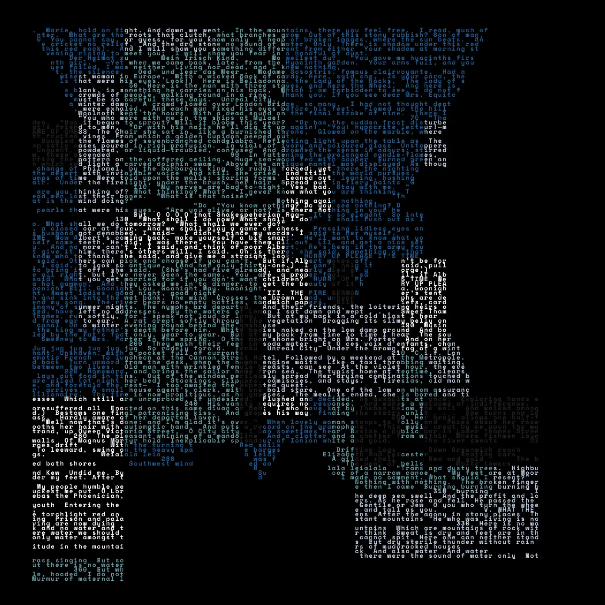

Feeling stuck in that avenue, I returned to more basic shapes to fill the grid, but tried to make the contents of those shapes a bit more interesting. Here I packed circles into irregular shapes and in turn placed those into rectangles.

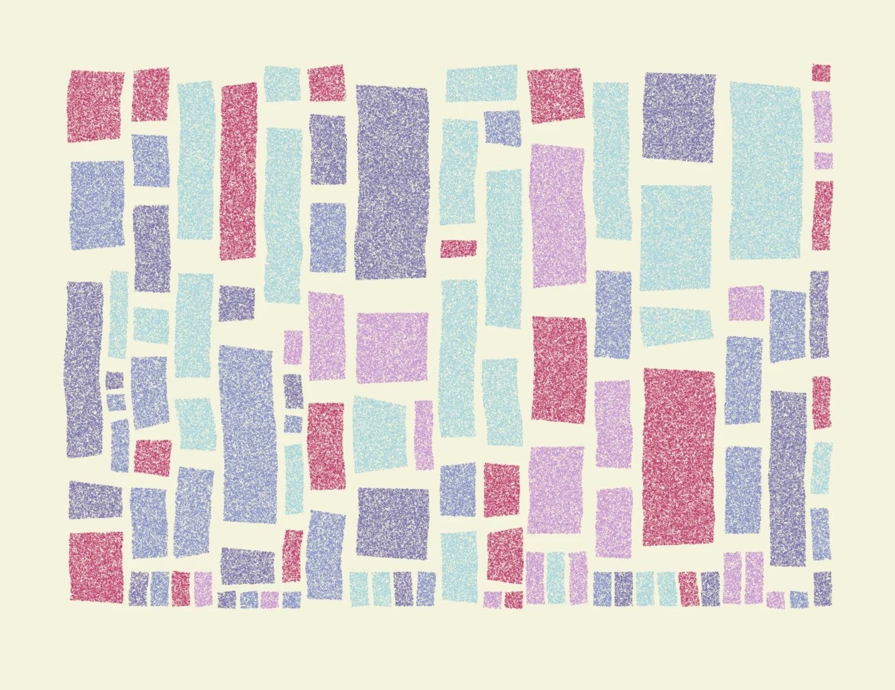

Here I use Perlin Noise to find contours of imaginary lands. I then make a wall of maps:

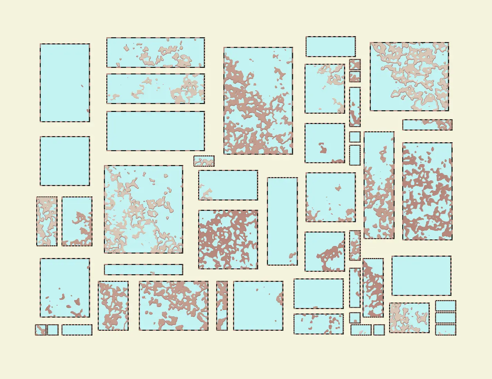

And here I simply have contained flow fields of a more traditional sort.

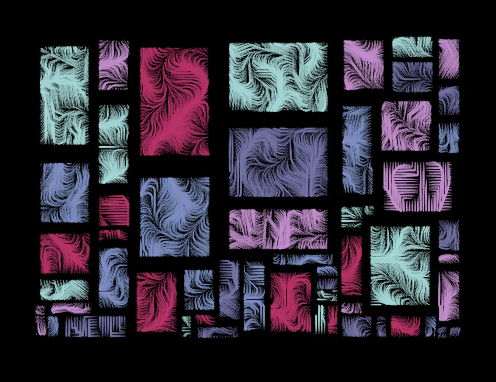

I textured this using a custom brush I wrote. Basically, I find uniformly random points within a circle. These are meant to simulate brush hairs. These will place dots of varying size and transparency. I then move this circle along a path and it creates a nice natural looking line. This is one of my most frequently used texturing techniques.

```java
import processing.core.PApplet;
import processing.core.PVector;

class Brush{
    float rad, cx, cy, z;
    int col;
    BrushTip[] brushEnds;
    PApplet pApplet;

    Brush(float r, float x, float y, int c, PApplet pApplet) {
        rad = r;
        cx = x;
        cy = y;
        col = c;
        this.pApplet = pApplet;

        int cap = ((int) rad * (int) rad) * 4;
        brushEnds = new BrushTip[cap];
        for (int i = 0; i < cap; i++) {
            brushEnds[i] = getBrushTip();
        }
    }

    void render() {
        pApplet.pushMatrix();
        pApplet.translate(cx, cy);
        pApplet.colorMode(pApplet.HSB, 360, 100, 100, 1);
        for (BrushTip bt : brushEnds) {
            if (pApplet.random(1) > .1) {
                pApplet.strokeWeight(bt.sz);
                pApplet.stroke(col, .1f);
                pApplet.point(bt.pos.x, bt.pos.y);
            }
        }
        pApplet.popMatrix();
    }

    BrushTip getBrushTip() {
        float r = rad * pApplet.sqrt(pApplet.random(0, 1));
        float theta = pApplet.random(0, 1) * 2 * pApplet.PI;
        float x = r * pApplet.cos(theta) + pApplet.randomGaussian();
        float y = r * pApplet.sin(theta) + pApplet.randomGaussian();
        return new BrushTip(new PVector(x, y), .2f + pApplet.abs(pApplet.randomGaussian()));
    }

    public static void lerpLine(float x1, float y1, float x2, float y2, Brush b, PApplet pApplet) {
        float d = pApplet.dist(x1, y1, x2, y2);
        for (float i = 0; i < d; i++) {
            b.cx = pApplet.lerp(x1, x2, i/d);
            b.cy = pApplet.lerp(y1, y2, i/d);
            b.render();
        }
    }
}


class BrushTip {
    float sz;
    PVector pos;

    BrushTip(PVector xy, float isz) {
        pos = xy;
        sz = isz;
    }
}
```

If you really think about it, everything is an irregular grid in the world of [raster graphics](https://en.wikipedia.org/wiki/Raster_graphics). A raster image, after all, is a very fine grid, and anything placed within that grid occupies a certain number of grid squares.

Thinking this way, it is possible to organize very disparately sized things. It was this thinking that allowed me to implement my own [wordcloud](https://en.wikipedia.org/wiki/Tag_cloud) generators. One can take this beyond just regular shaped wordclouds and have wordclouds of any shape. As a proof of concept, here is a wordcloud combined with circle packing.

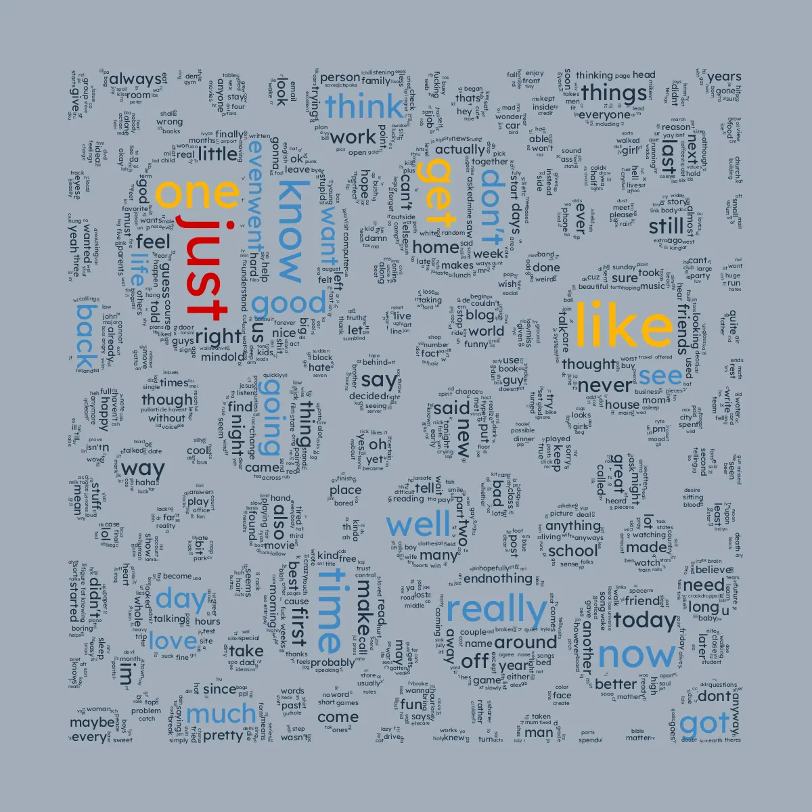

As a note of interest, the words for that were taken from a [dataset of blog posts from 2004](https://u.cs.biu.ac.il/~koppel/BlogCorpus.htm).

I think I can just fit this one into an already irregular blog post– the components ended up being small enough to not need much packing logic, but here I repurposed an irregular grid to accommodate some [A* pathfinding](https://en.wikipedia.org/wiki/A*_search_algorithm).

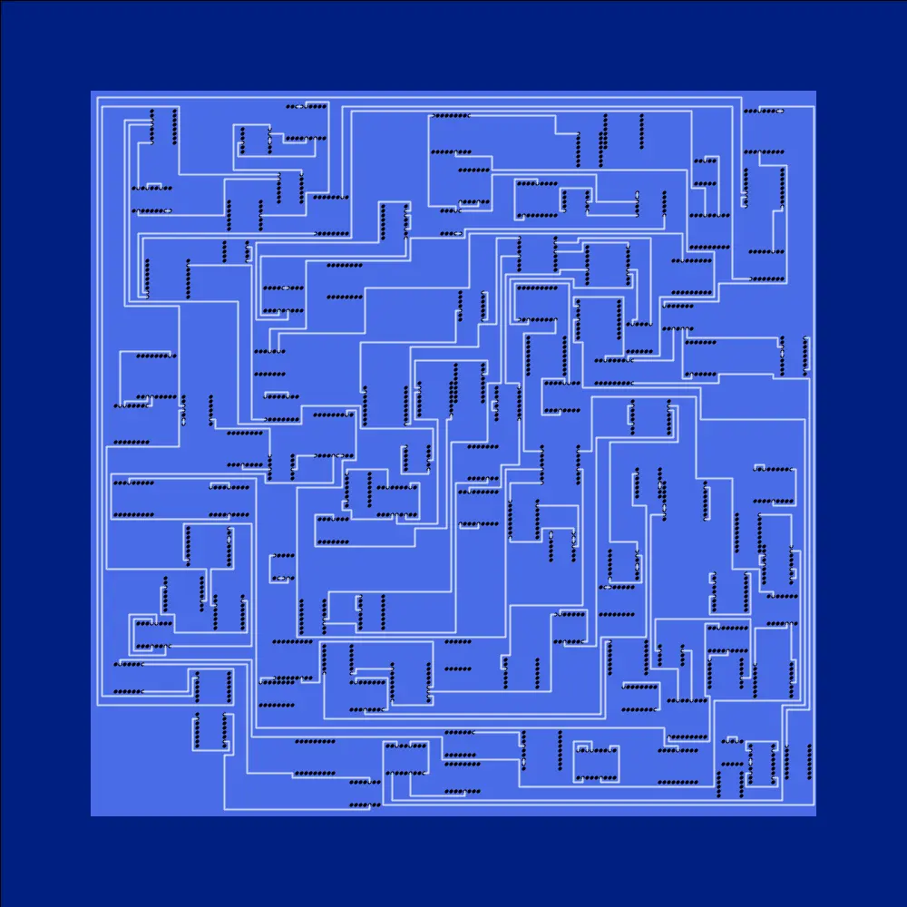

As so often happens with these matters, this is more difficult than it might appear.

Finally, “the end of all our exploring will be to arrive where we started”. Here I am paying special attention to borders, empty space, and throwing in a little Perlin noise to offset the emptiness, yet still have decidedly familiar looking output.

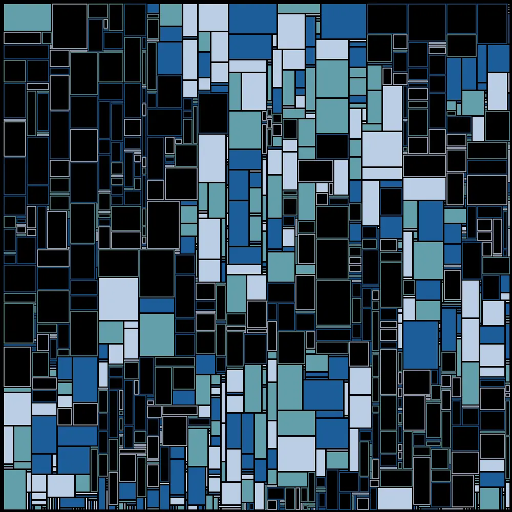

Thanks for reading!
