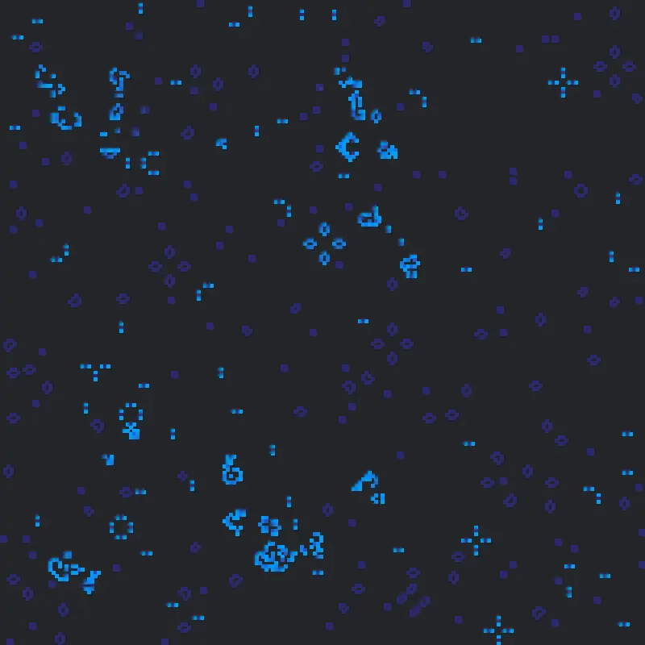
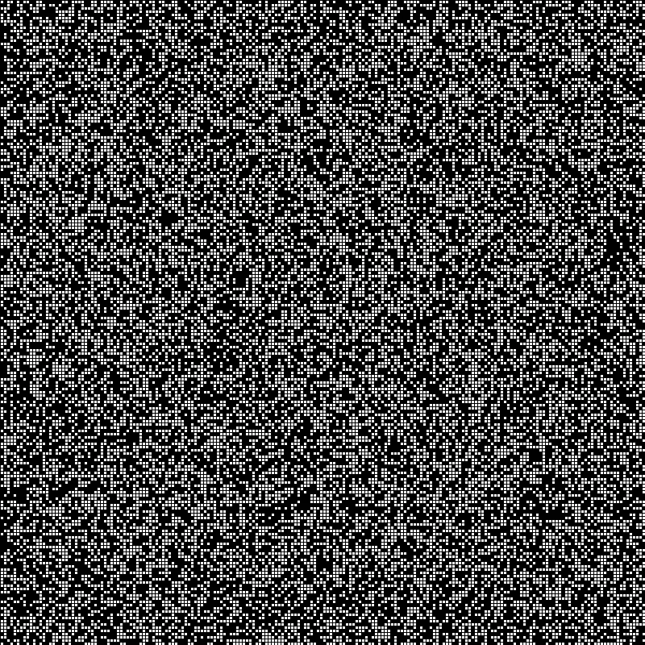
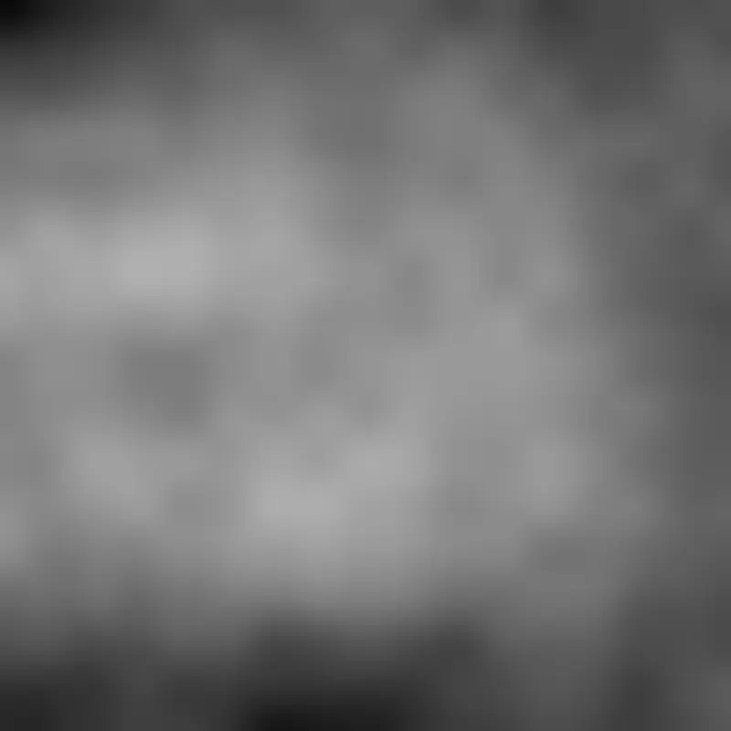

Title: A Noisy Life 
Date: 2023-08-21 00:00
Category: post
card_image: /images/noisylife1.webp
hero_image: /images/noisylife1.webp
hero_caption: Photo credit: <a href="https://thelastindex.com"><strong>TheLastIndex</strong></a>
hero_text: An experiment of regenerating life. 

I wanted to see what would happen when I combined the continuous space of [Perlin Noise](https://en.wikipedia.org/wiki/Perlin_noise) with the discrete states of cellular automata, specifically, [Conway’s Game of Life](https://en.wikipedia.org/wiki/Conway%27s_Game_of_Life).

Conway imagines life as a 2D Array of “Cells”, each alive or dead, with life being determined by the number of neighboring alive cells and the cell’s current state. The rules are simple and here quoted exactly from the above wikipedia article:

1. Any live cell with two or three live neighbours survives.
2. Any dead cell with three live neighbours becomes a live cell.
3. All other live cells die in the next generation. Similarly, all other dead cells stay dead.

There’s a lot that has been said about Conway’s life, and it’s a neat subject. For instance, did you know that entire computers have been built according to these rules? [They have](https://www.youtube.com/watch?v=8unMqSp0bFY).

If you fill the board randomly, it tends to immediately start evolving into disparate chunks of recognizable patterns. The universe according to these rules hits a sort of equilibrium, spreading out into small relatively static or predictable islands of life after several generations. 



[Perlin Noise](https://en.wikipedia.org/wiki/Perlin_noise) is probably the most seductive technique in generative art. It is perhaps best explained in conjunction with randomness. Consider a grid, coincidentally much like the board in Conway’s game, and randomly color it (again sounding familiar) according to two states, on or off, and you will see something like TV static: one cell’s state seems to have little or no relationship to the cells around it.



With Perlin Noise, instead of each cell having a binary state, they can instead have a floating point number. Each number, however, is near in value to the numbers of nearer cells. This creates continuous shapes and contours rather than a discreet static. Even though I am asking you to picture 2 dimensions of noise, it can be expanded to three or even four dimensions.



My thought was to combine 3D Perlin noise with Conway’s rules. I expected to have pockets of connected life growing and shrinking over time rather than the relatively static results of a long running traditional Life simulation.

Let’s look at some code. My two obvious needs are a game board, and a cell. Let’s start with the gameboard, it’s most straight forward.

```java
class GameBoard {
  int width, height;
  float generation;
  float timeIncrement = 0.01;
  Cell[][] board;


  GameBoard(int width, int height) {
    this.width = width;
    this.height = height;
    this.board = new Cell[width][height];
    generation = 0.0;

    for (int x = 0; x < width; x++) {
      for (int y = 0; y < height; y++) {
        board[x][y] = new Cell(x, y, random(1) > .5); // Random initial state
      }
    }
  }

  Cell[][] getNeighbors(int x, int y) {
    Cell[][] neighbors = new Cell[3][3];
    for (int i = -1; i <= 1; i++) {
        for (int j = -1; j <= 1; j++) {
            int nx = x + i;
            int ny = y + j;
            if (nx >= 0 && ny >= 0 && nx < width && ny < height && (i != 0 || j != 0)) {
                neighbors[i + 1][j + 1] = board[nx][ny];
            }
        }
    }

    return neighbors;
}

  void evolve() {
    boolean[][] newStates = new boolean[width][height];

    for (int x = 0; x < width; x++) {
      for (int y = 0; y < height; y++) {
        newStates[x][y] = board[x][y].willLiveNextGen(getNeighbors(x, y));
        board[x][y].advanceZ(this.timeIncrement);
        board[x][y].updatePerlinValue();

      }
    }

    for (int x = 0; x < width; x++) {
      for (int y = 0; y < height; y++) {
        board[x][y].alive = newStates[x][y];
      }
    }
  }
}
```

There are no surprises here. Our constructor initializes the board state, giving each cell an alive or dead state at roughly fifty percent probability. We have a method to get the neighboring cells of any individual space. Anything new here is in the evolve method.

Notice that the timeIncrement in this code is a bit on the small side at .01. One thing to notice here is that I am not increasing generations by whole numbers and this is because when you make large increments in Perlin noise you lose a lot of the “continuity” it brings, and this includes on higher dimensions. Even though we are keeping track of time, I wanted shapes to grow and shrink continuously, not jitter all over the screen.

Finally, we have a call to update the perlinValue of the given cell.

Let’s look at what makes this possible.

```java
  void updatePerlinValue() {
    this.perlinValue = noise(this.x * 0.01f, this.y * 0.01f, z);
  }

  void advanceZ(float increment) {
    z += increment;
  }
```

These two methods are from a separate Cell class. I wanted to look at them in isolation to emphasize their relationship. As you can see, we scale cell positions by values, just like we move the z coordinate at small increments.

The fate of each cell is determined by a combination of it’s perlinValue, life state (alive), and its aliveNeighbors.

```java
boolean willLiveNextGen(Cell[][] neighbors) {
    int aliveNeighbors = 0;
    for (Cell[] row : neighbors) {
        for (Cell cell : row) {
            if (cell != null && cell.alive) {
                aliveNeighbors++;
            }
        }
    }

    if ((aliveNeighbors == 2 || aliveNeighbors == 3) && this.alive || this.perlinValue > perlinThreshold) {
      float potential = age + .1;
      age = min(potential, 1);
      return true;
    }

    if ((aliveNeighbors == 3) && !this.alive || this.perlinValue > perlinThreshold) {
      age = 0;
      return true;
    }

    if (!this.alive && this.perlinValue > perlinThreshold) {
      age = 0;
      return true;
    }

    return false;
  }
}
```

Age isn’t terribly important other than the interpolate color as a value of 0 to 1. The oldest cells will appear darker, the newer cells will be lighter. The key observation here is that I have maintained Conway’s traditional ruleset exactly, only adding an optional condition for life based on a preset threshold. Having a value above this threshold helps ensure a cell lives. This will ensure that pockets of connected and continuous space will continually refresh life on our board.

The noise giveth and the noise taketh away.

This was fun to make, but unfortunately I have to conclude that this project is more theoretically than visually interesting, especially without animation. To that end, here is a video:

<iframe title="vimeo-player" src="https://player.vimeo.com/video/856305173?h=031f48f590" width="640" height="360" frameborder="0" referrerpolicy="strict-origin-when-cross-origin" allow="autoplay; fullscreen; picture-in-picture; clipboard-write; encrypted-media; web-share"   allowfullscreen></iframe>

Here is java [source code](https://github.com/tetrismegistus/GenArt/tree/main/general_sketches/NoisyCA). Thank you for reading!
