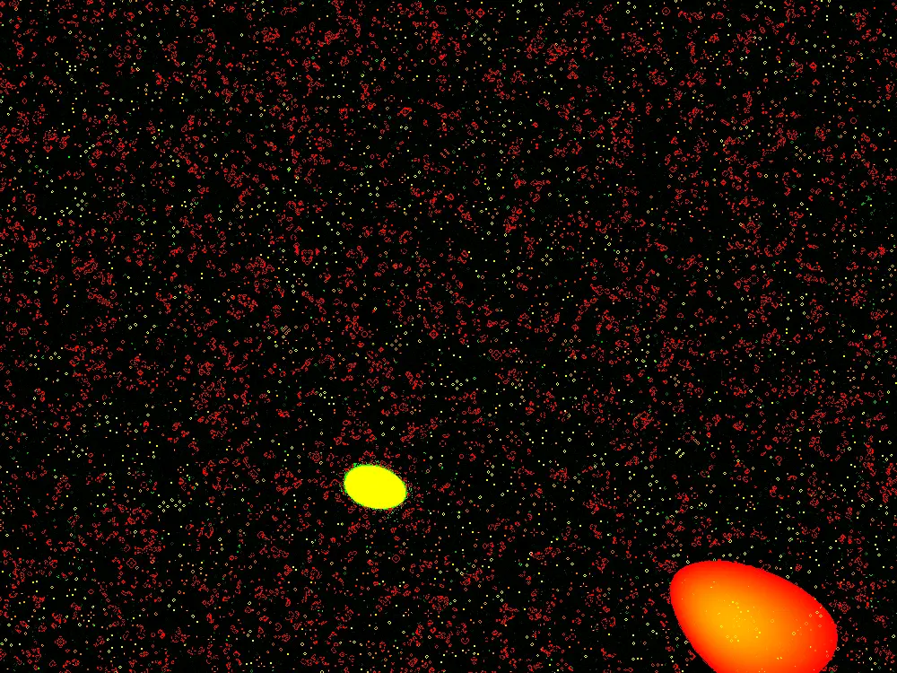
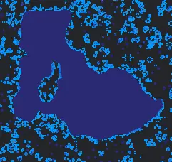
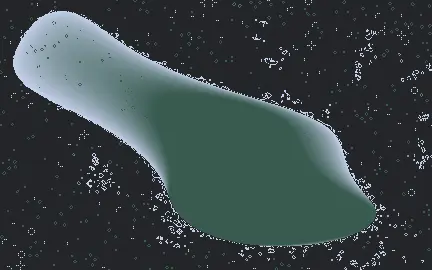

Title: A Shade of Progress
Date: 2023-08-22 00:00
Category: post
card_image: /images/shader2.webp
hero_image: /images/shader2.webp
hero_caption: Photo credit: <a href="https://thelastindex.com"><strong>TheLastIndex</strong></a>
hero_text: Improving appearance and performance of noise driven-life with shaders.

I wanted to improve performance of my [Game of Life simulation](http://thelastindex.com/noisylife/) using [shaders](https://en.wikipedia.org/wiki/Shader). I did so using two different frameworks, [shadertoy](https://en.wikipedia.org/wiki/Shader) and [processing](https://processing.org/).

I’m not very experienced with shaders and in general find them challenging. Shaders ask you to view your drawing entirely from the perspective of individual pixels. Any state has to be broadcast to each pixel en masse via a uniform.

In processing/glsl this looks something like this

```glsl
uniform sampler2D currentStateTexture;
uniform vec2 texelSize; // Size of a single texel, computed as (1.0/width, 1.0/height)
uniform float perlinThreshold; // You need to pass this value into the shader
uniform float time;
```

But I found that in shadertoy I had to embed more values directly into the shader.

I quickly learned that representing The Game of Life to a shader involved using a texture as a data structure. This was neat and unexpected to me. In retrospect, it’s obvious, the texture is already a 2d array, and the color channels can be used to represent various pieces of information, red for the cells live/dead state, green for its age.

```glsl
    float currentState = currentData.r;
    float currentAge = currentData.g;
```

This works perfectly for representing data in a visual layer, but it is a little bit ugly when using those same channels to represent the data on the screen:
Ugly Life



What I wanted was a way to interpolate between two arbitrary colors as I had in my CPU implementation. I quickly learned that I need two shaders to do so, a compute shader to run the simulation, and a fragment shader to handle the color interpolation at display time. The reason for this is that if I am displaying to the screen and reading that texture as the data, it messes up the simulation. Multiple shaders keep a nice separation between the simulation data and the display logic.

In processing I can pass in the colors as uniforms and the display logic is very short and simple

```glsl
#ifdef GL_ES
precision mediump float;
#endif

uniform sampler2D currentStateTexture;
uniform vec2 texelSize;
uniform vec4 color1; // First color, e.g., vec4(1.0, 0.0, 0.0, 1.0) for red
uniform vec4 color2; // Second color, e.g., vec4(0.0, 0.0, 1.0, 1.0) for blue
uniform vec4 deadColor;

void main() {
    vec2 uv = gl_FragCoord.xy * texelSize;
    vec4 cellData = texture2D(currentStateTexture, uv);
    float cellState = cellData.r;
    float cellAge = cellData.g;

    vec4 finalColor;
    if(cellState == 1.0) { // If the cell is alive
        // Interpolate between color1 and color2 based on age
        finalColor = mix(color1, color2, cellAge);
    } else {
        finalColor = deadColor;
    }

    gl_FragColor = finalColor;
}
```

You will also notice that the noise is making much smoother blobs.

Old:


New:


Because I am simulating on the shader level, and using the built in processing noise() function for every pixel would lose any speed advantage from doing so, I must use a noise function in glsl. There are no reliable noise implementation in glsl, so I copied and pasted a noise implementation from here. I needed to multiply the noise function by larger than zero values to zoom out.

```glsl
    float noiseVal = cnoise(vec4(uv.x * 6.25, uv.y * 6.25, time, 0.0));
```

This is opposite from my normal need, which is to find smaller spaces between noise values, scaling often by 0.01 or even 0.001. I could make more complicated “blobs” by using octaves, and that probably will be my next avenue of exploration.

Anyway, moving this to a shader was fun and educational. I have a lot to learn about shaders in general, but this is a good start, I think.

Source code for the java/processing implementation is [here](https://github.com/tetrismegistus/GenArt/tree/main/general_sketches/shader_conway).

A demo is available on shadertoy, but beware, shaders and cell phones are funny things. I had to run this simulation with high precision floating point numbers to get this to render on my phone, I cannot promise this will work for you on a phone browser:

<div class="center-iframe-container">
	<iframe src="https://www.shadertoy.com/embed/mtXBRM?gui=true&amp;t=10&amp;paused=false&amp;muted=false" allowfullscreen=""></iframe>
</div>

If the above does not work for you, here is a video version:

<iframe width="560" height="315" src="https://www.youtube.com/embed/ZTPcJhnWWek?si=1wiM1HFd7xnik4eu" title="YouTube video player" frameborder="0" allow="accelerometer; autoplay; clipboard-write; encrypted-media; gyroscope; picture-in-picture; web-share" referrerpolicy="strict-origin-when-cross-origin" allowfullscreen></iframe>

Thanks for reading!


