Title: Asemic Writing with Poisson Disc Sampling
Date: 2023-08-28 00:00
Category: post
card_image: /images/asemic_hero.webp
hero_image: /images/asemic_hero.webp
hero_caption: Photo credit: <a href="https://thelastindex.com"><strong>TheLastIndex</strong></a>
hero_text: Let's talk about the art of writing nothing.

[Asemic writing](https://en.wikipedia.org/wiki/Asemic_writing) is the attempt to approach the look of the visual word, without any attached meaning. 

In the past I’ve accomplished something like human script by distorting points along a line in an extreme fashion. It looks like this.

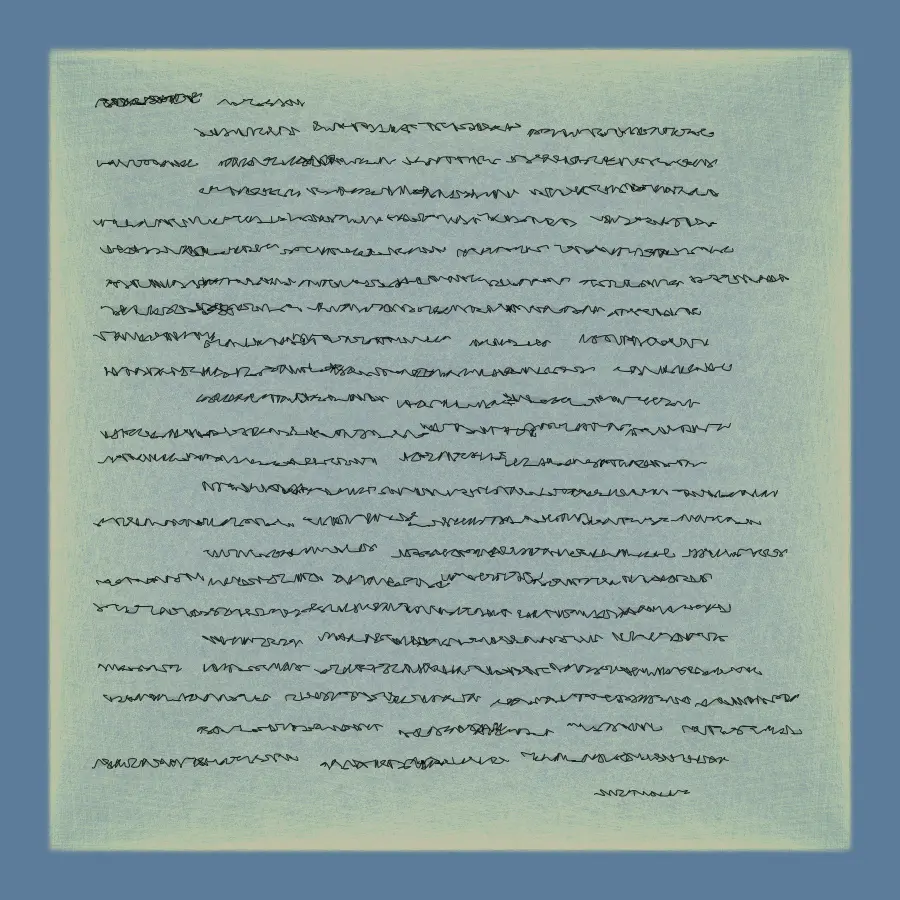

In lazier moments though I’ve just used Bézier curves:

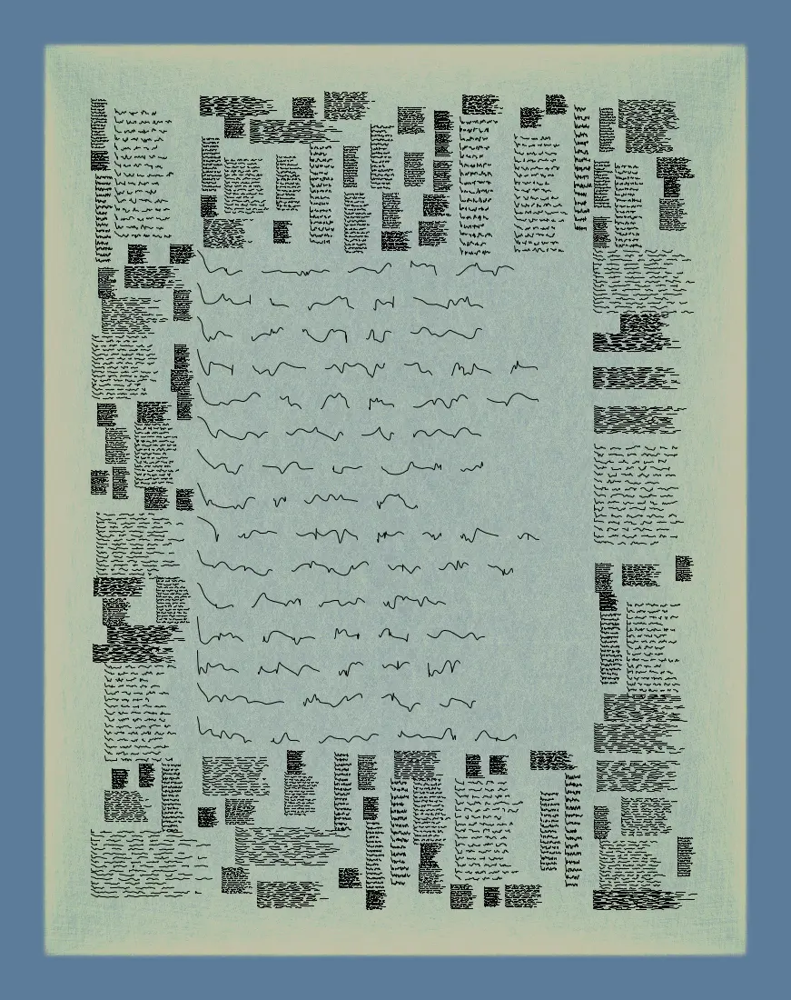

That grid looks a bit [irregular](https://thelastindex.com/igrid/), doesn’t it?

Today, however, I want to approach it by discovering a number of points in a controlled space. Anders Hoff over at inconvergent has a tremendously [helpful article](https://inconvergent.net/2017/spline-script/) that serves as inspiration. Hoff selects his points with Voronoi regions, then connects them with splines. The result looks like this without the regions visible:

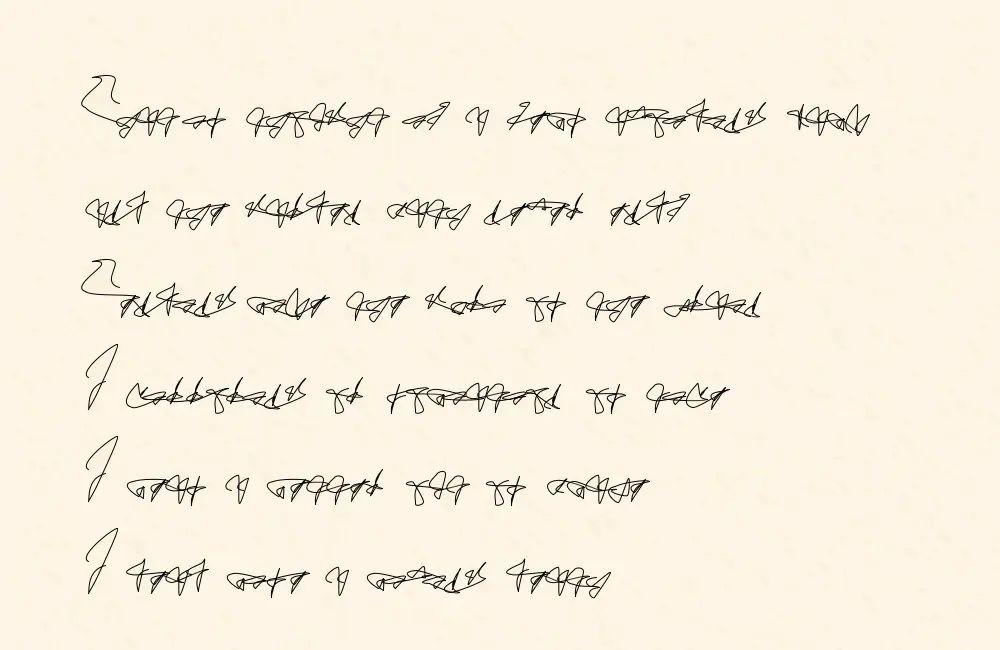

And here you can see the regions in a way that helps illustrate where the points for spline curved are derived from:

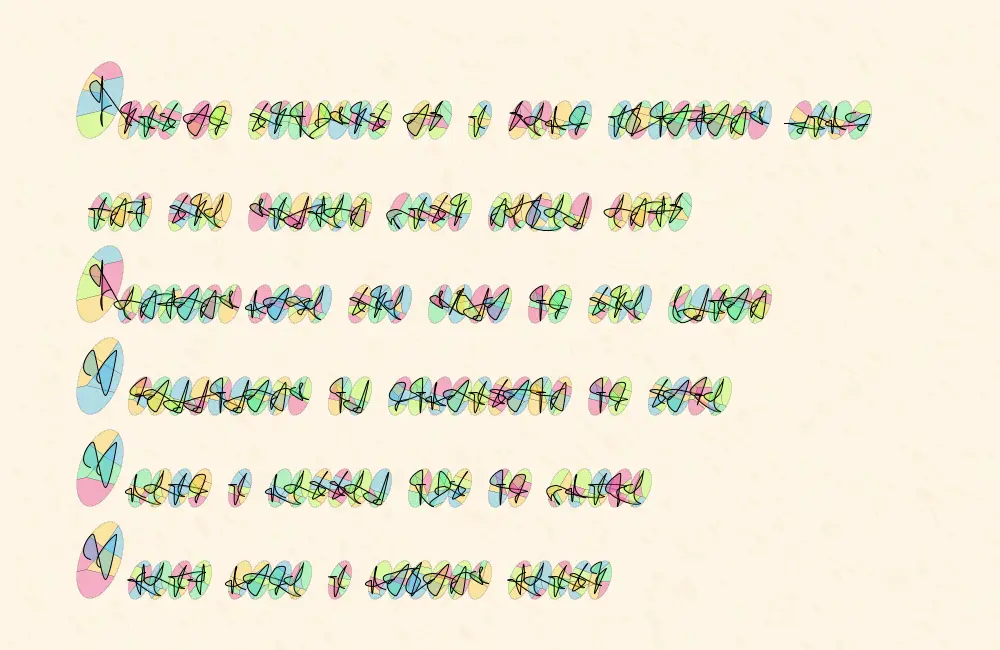

As you can see the extra structure of selecting the points of the curve by separate distinct regions does a lot to make things more convincing. To explore this further I wanted to attempt two different methods of choosing points.

## Method the First: Blocky AsemicPermalink

To start with, let’s take a nine-bit integer, represent it in binary, and stack the digits into a sort of primitive bitmap.

For instance, the number 441, 110111001 in binary, can be arranged as such:

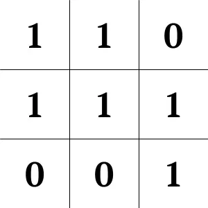

Here’s a selection of integers drawn as simple bitmaps:


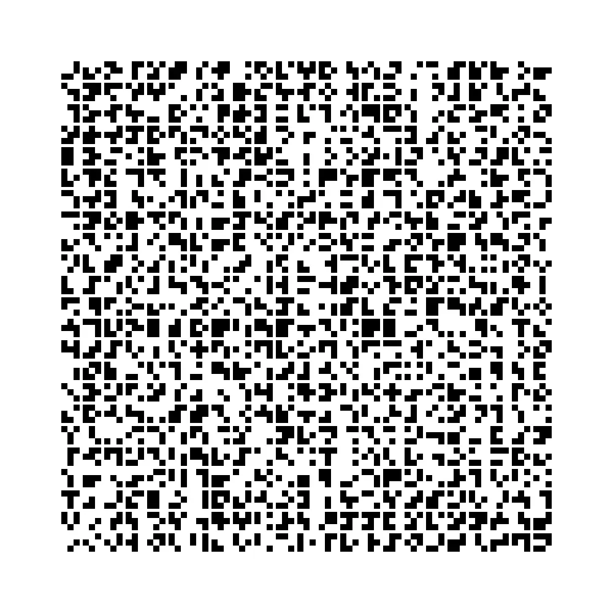

I can treat each filled in square center as a point in a curve, and simply connect them.

Here is a function that achieves that:

```java
    private void drawScaledChar(char c, float x, float y, float scale, float tileSize) {
        ArrayList<PVector> vectors = asciiMap.get(c);

        pushMatrix();
        translate(x, y);
        scale(scale);

        noFill();
        stroke(0);
        strokeWeight(2);
        beginShape();
        // Adding a curveVertex at the starting corner for curve continuity
        curveVertex(0 * tileSize + tileSize / 2, 0 * tileSize + tileSize / 2);

        for (PVector vec : vectors) {
            float px = vec.x * tileSize + tileSize / 2;
            float py = vec.y * tileSize + tileSize / 2;
            curveVertex(px, py);
        }

        // Adding a curveVertex at the ending corner for curve continuity
        curveVertex(2 * tileSize + tileSize / 2, 2 * tileSize + tileSize / 2);
        endShape();

        popMatrix();
    }
```

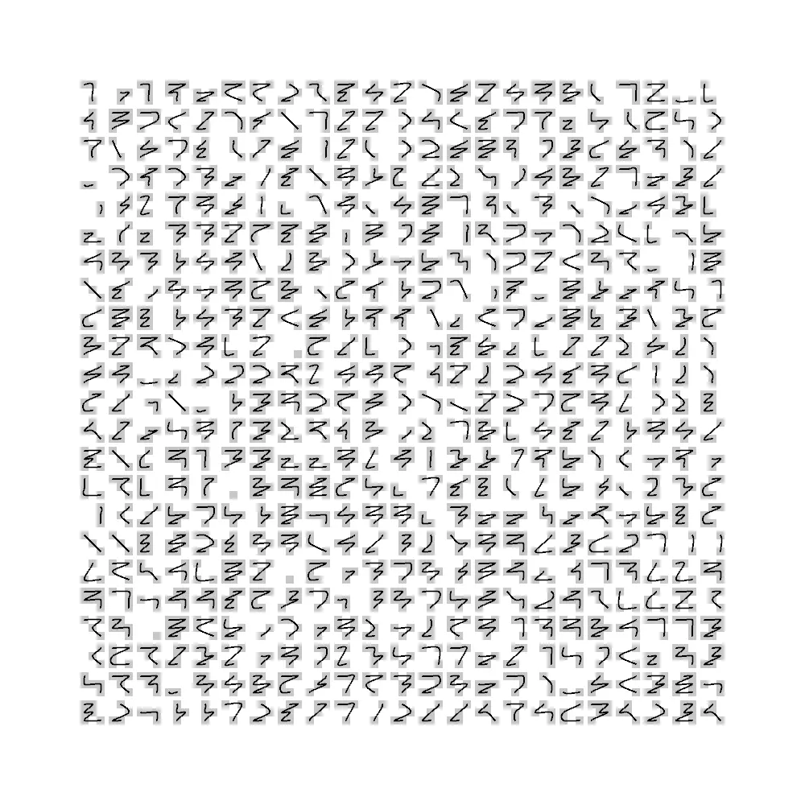

Without any blocks:

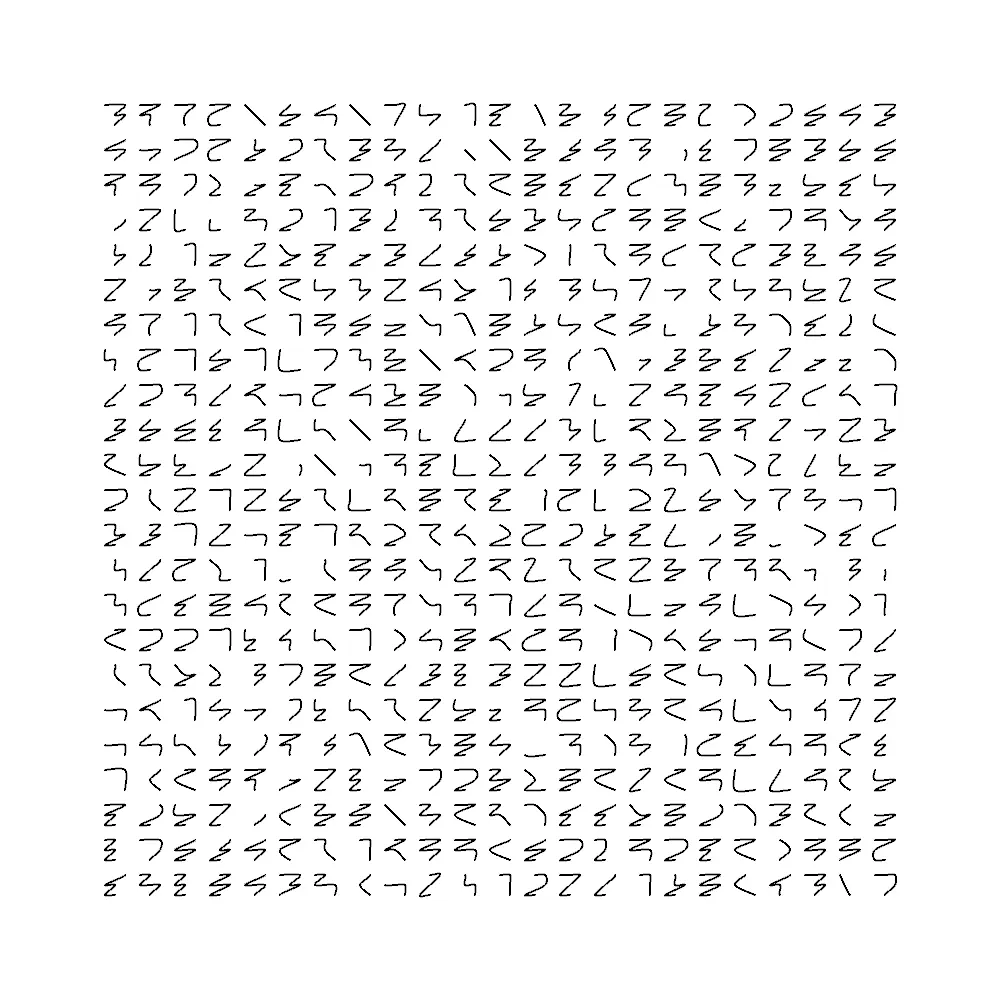

Nine is actually more bits than I need given that ASCII can be represented in 7 bits, extended ASCII in 8, and it’s doubtful that I’m going to want to use more printable characters than are available in those sets. Regardless, I could take every printable character, assign it a numeric value, then I would have a proper alphabet.

```java
    private void generateAsciiMap() {
        ArrayList<Integer> randomValues = new ArrayList<>();

        // Generate a list of unique 9-bit integers that have at least two '1' bits.
        for (int i = 0; i < 512; i++) {
            int bitCount = Integer.bitCount(i);
            if (bitCount >= 2) {
                randomValues.add(i);
            }
        }

        // Shuffle the list.
        Collections.shuffle(randomValues);

        int numChars = 126 - 32 + 1;


        int index = 0; // Index to keep track of the shuffled list.
        for (char c = 32; c <= 126; c++) {
            ArrayList<PVector> vectors = new ArrayList<>();
            int randomValue = randomValues.get(index);

            for (int row = 0; row < 3; row++) {
                for (int col = 0; col < 3; col++) {
                    int bitIndex = col + row * 3;
                    int bit = (randomValue >> bitIndex) & 1;

                    if (bit == 1) {
                        vectors.add(new PVector(col, row));
                    }
                }
            }

            asciiMap.put(c, vectors);
            index++;
        }
    }
```

This is a bit over engineered, but it does a couple things for me:

* It avoids using the same symbol every time I run the program by shuffling the list of integers that can be assigned to a level.
* It avoids values that only have 1 bit because those values don’t provide enough points for a curve.

Admittedly this doesn’t make the most believable alphabet, but it does illustrate how having any strategy at all for selecting points can make the glyphs more coherent. Let’s randomly assign each US ASCII printable character an asemic letter, add some word wrapping logic and read the first paragraph of [The Library of Babel](https://en.wikipedia.org/wiki/The_Library_of_Babel).

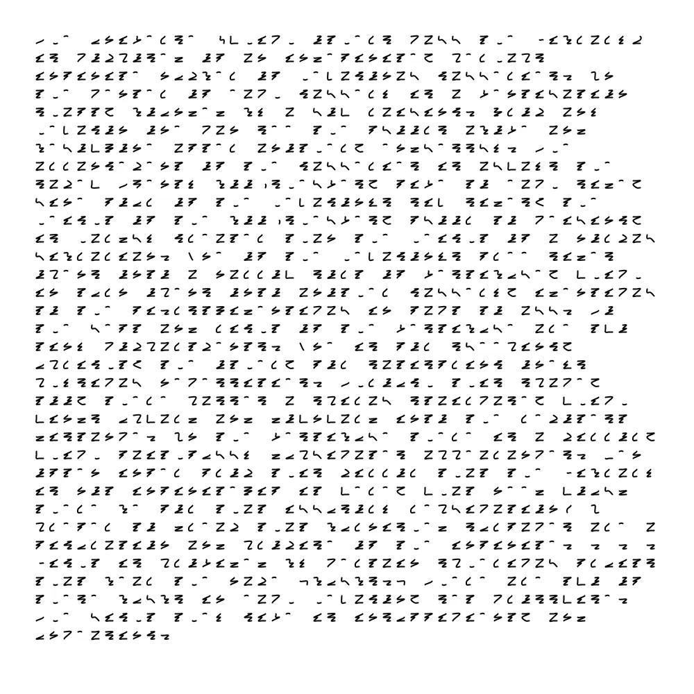

This is actually pretty attractive, and I can run with it… but the characters are all so self-similar, the lines so straight, etc etc.

## Method the Second: Poisson Disc Sampling

Since Hoff already has shown that Voronoi regions are a good way of selecting varied points to connect, there isn’t much value in me repeating that work. I was curious, however, what would happen if I used [Poisson Disc Sampling](https://en.wikipedia.org/wiki/Supersampling#Poisson_disk) for the same end. This should in theory allow me to avoid points that are too close together and should give me a much wider range of appearances for characters.

Poisson Disc Sampling allows me to find points in an area that have an organic/random looking distribution, but I can specify how tightly packed I want those points to be. I suspect this will allow me to make “letters” of varying legibility depending on how I space the points.

Manohar Vanga of the excellent [sighack](https://sighack.com/post/poisson-disk-sampling-bridsons-algorithm) covers Poisson Disc Samlping in detail and even provides code that can be used in processing, saving me a lot of time. For code relating to the sampling, please read directly from sighack, the only change I am making is to encapsulate his logic into a class and parameterizing the max width and height rather than using the full screen.

Most of my other logic was able to stay the same since I’m still working with lists of vectors, but there were some changes of course necessary.

First, I needed some logic to handle the scaling of my sample points. Since I am no longer starting all vectors in a tiny 3x3 space and spacing them out by the tileSize, but sampling from a larger space and spreading the points out while sampling, I need to normalize those back to a value between 0 to 1 so I can scale them back out predictably to fit my tile. Then, because the points can be sampled not necessarily around the center of my tile, I want to move my vectors back toward the center after sampling. I also need to set the radius for sampling at a pretty high value so that the points aren’t overly clustered together making them harder to spread out to the tile’s size.

```java
    private void generateAsciiMap() {
        float radius = 35f;
        int k = 30;
        float centerX = 100 / 2.0f;  // Assuming the width of the Poisson disc sampler is 100
        float centerY = 100 / 2.0f;  // Assuming the height of the Poisson disc sampler is 100
        PoissonDiscSampler sampler = new PoissonDiscSampler(100, 100, this);
        for (char c = 32; c <= 126; c++) {
            ArrayList<PVector> allSamples = sampler.poissonDiskSampling(radius, k);
            // Move points towards the center.
            for (PVector point : allSamples) {
                float dx = centerX - point.x;
                float dy = centerY - point.y;
                point.x += dx * 0.5;
                point.y += dy * 0.5;
            }
            // Further processing like trimming down the list if needed
            ArrayList<PVector> selectedSamples = new ArrayList<>();
            for (int i = 0; i < Math.min(6, allSamples.size()); i++) {
                PVector sample = allSamples.get(i);
                sample.x /= 100;
                sample.y /= 100;
                selectedSamples.add(sample);
            }
            asciiMap.put(c, selectedSamples);
        }
    }
```

Otherwise, the only other change necessary was to no longer multiply my vector positions by 3 as I was in the blocky version of drawScaledChar. After fiddling around and figuring this all out, I felt I had a decent start to character generation. Here is some debugging output generated at this point:


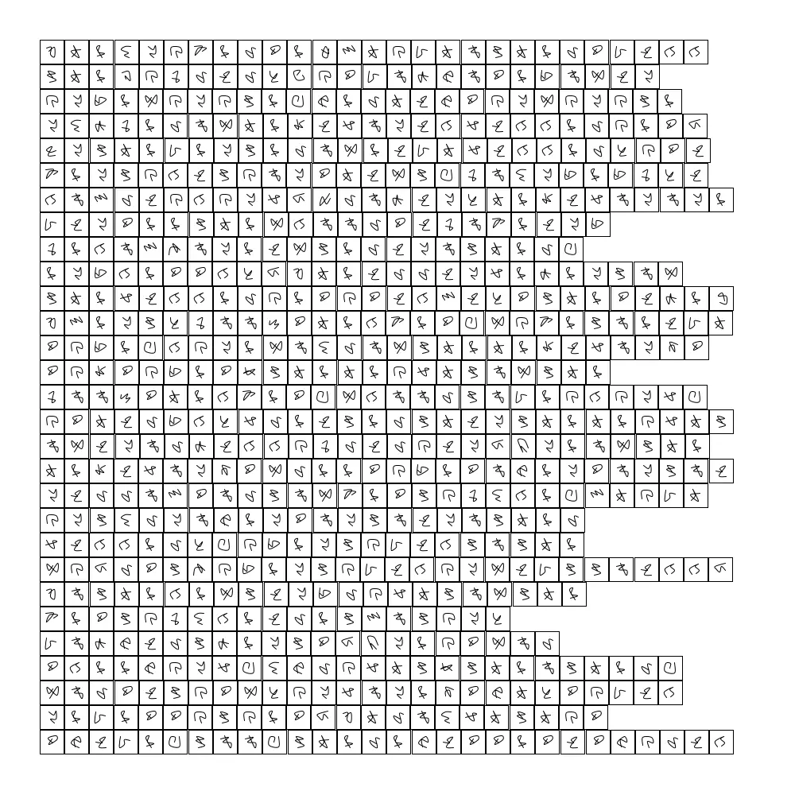

That’s a pretty big step. Now I want to take a few pieces of advice from Hoff at inconvergent:

* order my vectors “according to their angle relative to their centroid”
* connect the last vector of my letter to the first of the next, if there is a next in the same word
* rotate my vectors according to an angle to get slanted cursive look

To reorder my vectors, let’s add a function to compute centroids and then use that when sorting:

```java
    private PVector computeCentroid(ArrayList<PVector> points) {
        float cx = 0;
        float cy = 0;
        for (PVector point : points) {
            cx += point.x;
            cy += point.y;
        }
        return new PVector(cx / points.size(), cy / points.size());
    }

    private void generateAsciiMap() {
	// ...
        // rest of the code has not been changed
        allSamples.sort(new Comparator<PVector>() {
            @Override
            public int compare(PVector vec1, PVector vec2) {
               PVector centroid = computeCentroid(allSamples);
               PVector v1 = new PVector(vec1.x - centroid.x, vec1.y - centroid.y);
               PVector v2 = new PVector(vec2.x - centroid.x, vec2.y - centroid.y);
               float angle1 = atan2(v1.y, v1.x);
               float angle2 = atan2(v2.y, v2.x);

               return Float.compare(angle1, angle2);
            }
        });
        asciiMap.put(c, selectedSamples);
    }
```

To connect the letters, I moved out the logic to get the translated vectors into a function and then drew the word as one continuous curve.

```java
    private void drawWord(String word, float x, float y, float tileSize, float gap) {
        noFill();
        stroke(0);
        strokeWeight(1);
        beginShape();
        float xPos = x;
        for (char c : word.toCharArray()) {
            ArrayList<PVector> vectors = getTranslatedVectorsForChar(c, xPos, y, tileSize);
            for (PVector vec : vectors) {
                curveVertex(vec.x, vec.y);
            }
            xPos += tileSize + gap;
        }
        endShape();
    }

    private ArrayList<PVector> getTranslatedVectorsForChar(char c, float x, float y, float tileSize) {
        ArrayList<PVector> vectors = asciiMap.get(c);
        ArrayList<PVector> translatedVectors = new ArrayList<>();

        // Iterate through each vector, scale its position, and add the translation
        for (PVector vec : vectors) {
            float px = vec.x * tileSize + x;
            float py = vec.y * tileSize + y;
            translatedVectors.add(new PVector(px, py));
        }

        return translatedVectors;
    }
```

And finally a simple rotation for each vector is possible like so:

```java
PVector rotatePVectorAroundOrigin(PVector p, float angle, PVector origin) {
    // Move to origin
    float x = p.x - origin.x;
    float y = p.y - origin.y;

    // Rotate
    float newX = x * cos(angle) - y * sin(angle);
    float newY = x * sin(angle) + y * cos(angle);

    // Move back
    newX += origin.x;
    newY += origin.y;

    return new PVector(newX, newY);
}
```

Those changes made I receive this output:

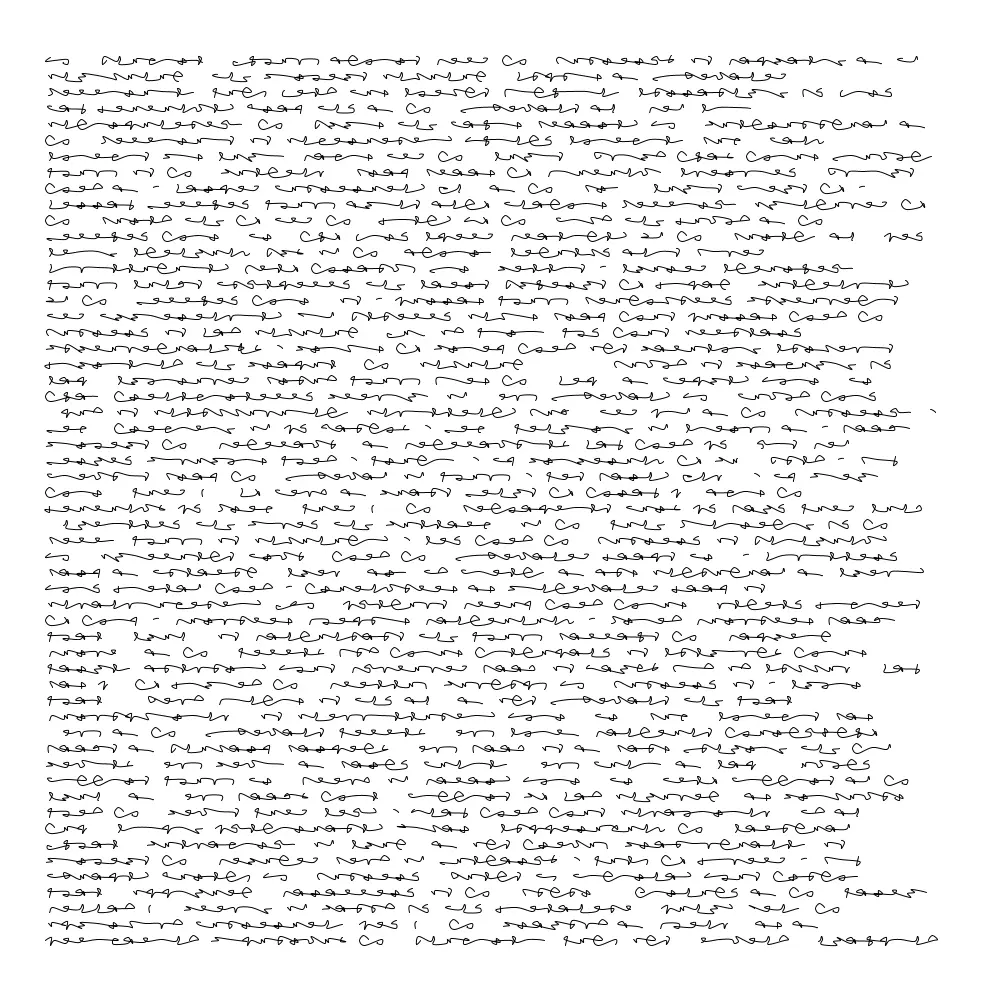

In the end, I think this does the job of tempting the eye to make sense of it. I believe I proved my suspicion correct that disc sampling can be used to generate asemic script, but there’s a lot more to do. This needs texture. This needs pen plotted. This needs laid out on a grid with cool diagrams, but I have to end somewhere!

I hope this has been interesting and I thank you for reading.
