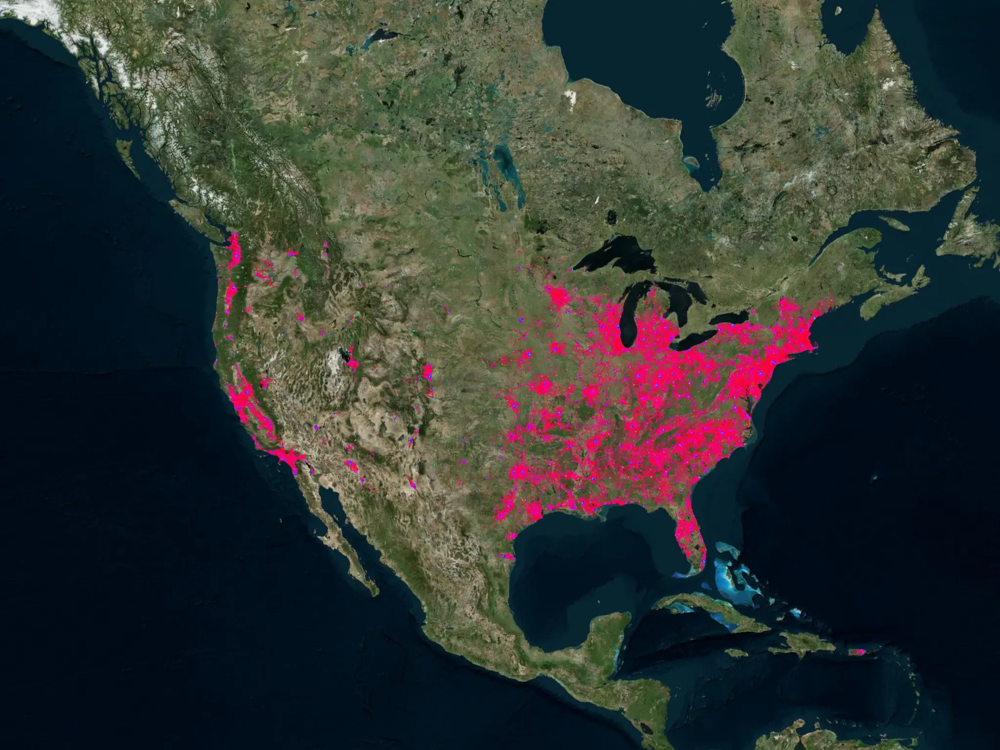
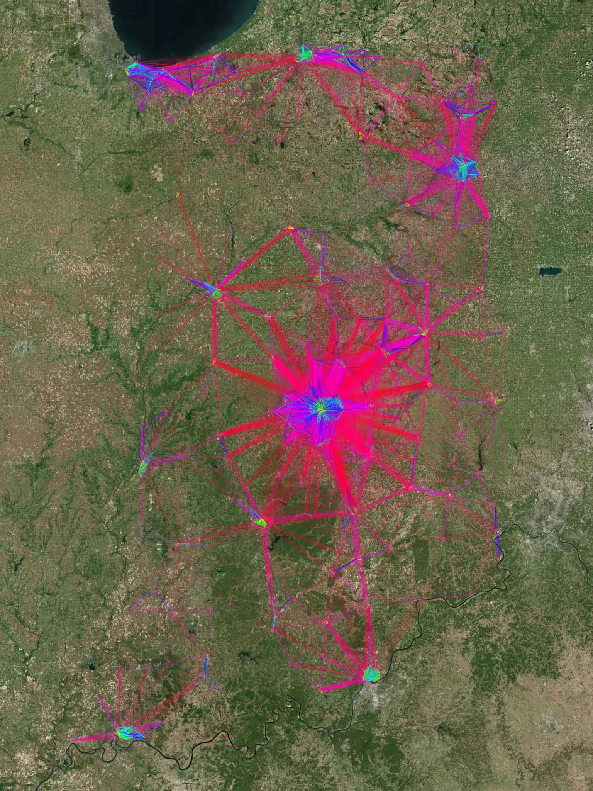
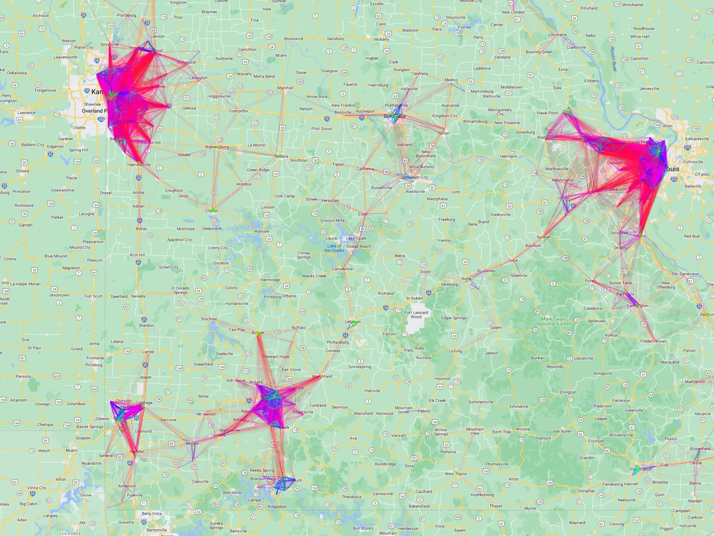

Title: Representing Geographical Data in Processing 
Date: 2023-08-17 00:00
Category: post
card_image: /images/spatial1.webp
hero_image: /images/spatial1.webp
hero_caption: Photo credit: <a href="https://thelastindex.com"><strong>TheLastIndex</strong></a>
hero_text: I had a large set of latitude and longitudes I wanted to represent.  This is what I learned.

My first attempt was just to project the points onto a blank canvas. First, I needed a concept of a reference point:

```java
class referencePoint{
  float scrX, scrY, lat, lon;
  PVector pos;

  referencePoint(float x, float y, float la, float ln) {
    scrX = x;
    scrY = y;
    lat = la;
    lon = ln;
  }

  void setPos() {
    pos = latLngToGlobalXY(lat, lon);
  }
}
```


I had a large set of latitude and longitudes I wanted to represent. This is what I learned.

My first attempt was just to project the points onto a blank canvas. First, I needed a concept of a reference point:

class referencePoint{
  float scrX, scrY, lat, lon;
  PVector pos;

  referencePoint(float x, float y, float la, float ln) {
    scrX = x;
    scrY = y;
    lat = la;
    lon = ln;
  }

  void setPos() {
    pos = latLngToGlobalXY(lat, lon);
  }
}

This object marries a screen x,y to a lat,long and provides a method for finding a global X,Y. We declare two reference points, one for the upper-left of a bounding rectangle on the screen and globe, the other for the lower-right of the same rectangle. I have a couple of helper functions, one to turn the coordinate into a flat projection for the whole globe, then one to translate that to the dimensions of my canvas.

```java
PVector latLngToGlobalXY(float lat, float lon) {
  float x = R * lon * cos((p0.lat + p1.lat)/2); //<>//
  float y = R*lat;
  return new PVector(x, y);
}

PVector latLngToScreenXY(float lat, float lon) {
  PVector pos = latLngToGlobalXY(lat, lon);
  float perX = ((pos.x - p0.pos.x)/(p1.pos.x-p0.pos.x));
  float perY = ((pos.y-p0.pos.y)/(p1.pos.y - p0.pos.y));
  return new PVector(p0.scrX + (p1.scrX - p0.scrX)*perX, p0.scrY + (p1.scrY - p0.scrY)*perY);
}
```

At load time I can simply iterate through all my coordinates and create an ArrayList of actual screen coordinates.

```java
  for (int i = 0; i < table.getRowCount(); i++) {
    float[] row = table.getFloatRow(i);
    float latitude = row[0];
    float longitude = row[1];
    if (latitude != Float.NaN && longitude != Float.NaN) {
      PVector pos = latLngToScreenXY(latitude, longitude);
      if(pos.x > 0 && pos.x < width && pos.y > 0 && pos.y < height) {
        points.add( new DataPoint(pos, 5));
      }
     }
   }
```

This simply provides locations I can plot, however. That may be interesting, but I am also interested in having visually interesting or appealing output. To that end I have a favorite function I found in the book [Generative Design](http://www.generative-gestaltung.de/1/) that will take any list of PVectors and draw lines between vectors within a radius at varying thickness and transparency, depending on the proximity of the connecting point.

```java
void connectPoints(ArrayList<PVector> points, float sw, float alpha, float radius) {
  for (int l1 = 0; l1 < points.size(); l1++) {
    for (int l2 = 0; l2 < l1; l2++) {
      PVector p1 = points.get(l1);
      PVector p2 = points.get(l2);
      float d = PVector.dist(p1, p2);
      float a = pow(1/(d/radius+1), 6);
      float h;
      if (d <= radius) {
        h = map(1-a, 0, 1, 0, 360) % 360;
        stroke(h, 100, 100, a*alpha);
        strokeWeight(sw);
        line(p1.x, p1.y, p2.x, p2.y);
      }
    }
  }
}
```

This function is fun to play around with. Here is a set of mostly random points connected.


Combining a dataset from [LIHTC](https://lihtc.huduser.gov/) with these techniques, I arrived at a recognizable shape, that I thought was somewhat interesting to look at:


At this point I was satisfied from an aesthetic perspective, but I did want to see what it looks like with a little more map information. This proved a challenge. There were many options for working with maps, and even multiple options in processing, but I went with [unfoldingmaps](http://unfoldingmaps.org/). This did have the requirement of running my sketch in a very old version of processing (version 2.2.1), but I found it easy to work with.

One challenge I had was that unfolding maps seemed to have interactive use in mind, which did not play with my extremely slow connectPoints function. I was able to solve most problems by handling advanced screen position calculations and line rendering before the main application loads in setup:

```java
void setup() {
    size(2048, 1536);
    screenpoints = new ArrayList<PVector>();
    colorMode(HSB, 360, 100, 100, 1);
    points = new ArrayList<PVector>();
    table = loadTable("data/mis.csv");
    // this provider was just my most recent run, outputs were made with varying providers.
    map = new UnfoldingMap(this, "Satellite Map", new Google.GoogleMapProvider());
    MapUtils.createDefaultEventDispatcher(this, map);
    table.setMissingFloat(0);
    for (int i = 0; i < table.getRowCount(); i++) {
    float[] row = table.getFloatRow(i);
    float latitude = row[0];
    float longitude = row[1];
    if (latitude != Float.NaN && longitude != Float.NaN) {
      PVector pos = new PVector(latitude, longitude);


      points.add(pos);
     }
   }
   map.zoomAndPanTo(9, center);

   for (PVector dp : points) {
      Location location = new Location(dp.x, dp.y);  // Coordinates for São Paulo, Brazil
      ScreenPosition pos = map.getScreenPosition(location);
      screenpoints.add(new PVector(pos.x, pos.y));
   }

   pg = createGraphics(width, height);
   pg.beginDraw();
   pg.colorMode(HSB, 360, 100, 100, 1);
   pg.clear();
   connectPoints(screenpoints, 1, 1, 200, pg);
   pg.endDraw();
}
```

This done, I’m able to responsively handle whatever happens in the event loop. Here are some results of combining maps with the connectPoints function:

Continental US on an aerial map:



Indiana on an aerial map:



Missouri on a google map:



Thanks for reading!

